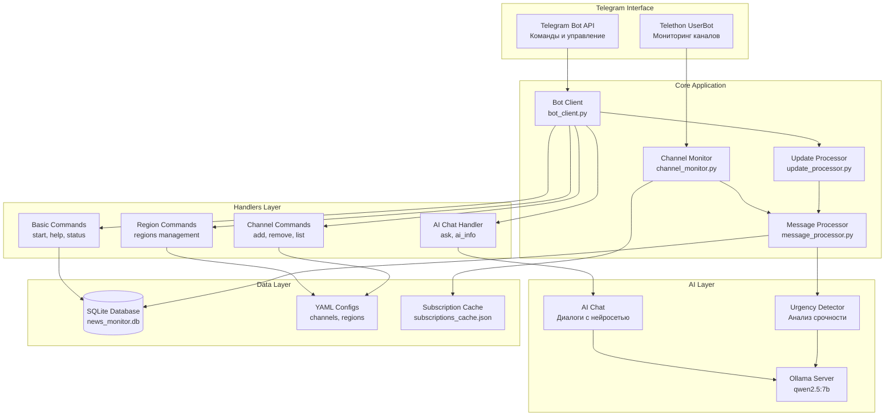
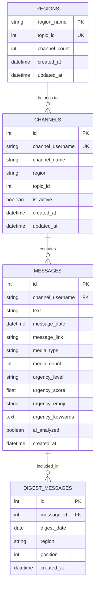
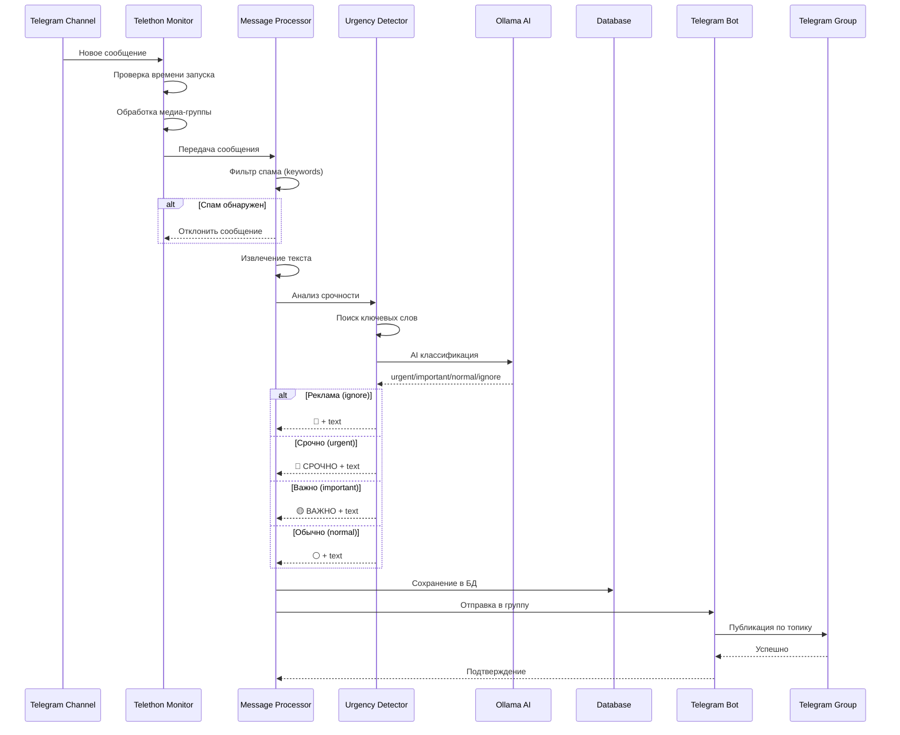
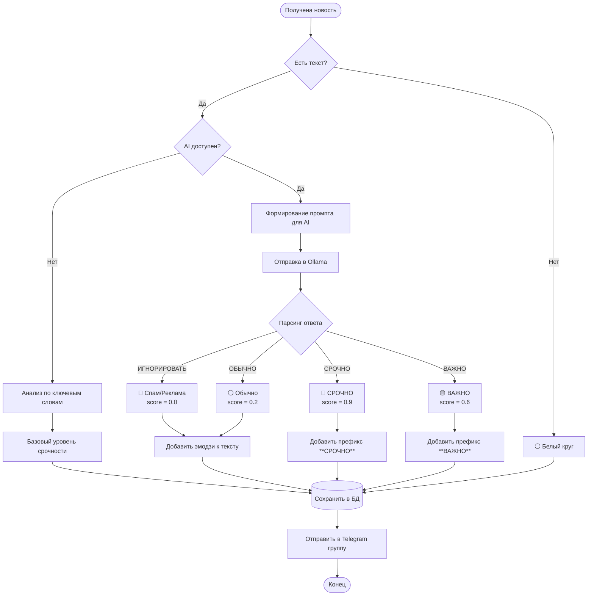
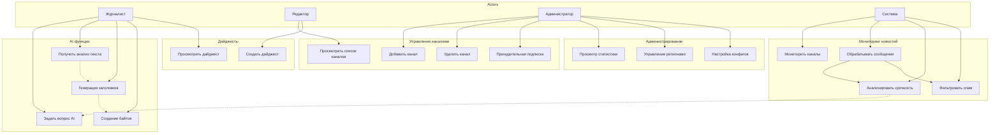

Все диаграммы в формате Mermaid. Их можно:
- Просмотреть прямо в GitHub/GitLab
- Экспортировать в PNG через https://mermaid.live/
- Открыть в VSCode с расширением Mermaid Preview

---




---




---




---




---


```mermaid
classDiagram
    class NewsMonitorWithBot {
        +ConfigLoader config_loader
        +DatabaseManager database
        +TelegramBot bot
        +ChannelMonitor telegram_monitor
        +initialize() bool
        +start() void
        +stop() void
    }
    
    class TelegramBot {
        -str bot_token
        -int group_chat_id
        -BasicCommands basic_commands
        -ChannelCommands channel_commands
        -AIChatHandler ai_chat
        +send_message(text, chat_id) bool
        +send_chat_action(action) bool
        +register_handlers() void
    }
    
    class ChannelMonitor {
        -TelegramClient client
        -dict monitored_channels
        +start_monitoring() void
        +add_channel(username) bool
        +remove_channel(username) bool
        +get_channel_entity(username) Entity
    }
    
    class MessageProcessor {
        -DatabaseManager database
        -NewsMonitorWithBot app_instance
        +process_new_message(message) void
        -_analyze_urgency(text) Dict
        -_save_to_database(data) void
    }
    
    class UrgencyDetector {
        -AsyncClient ollama_client
        -str model_name
        -dict urgent_keywords
        +analyze_news_urgency(text, source) Dict
        -_ai_classify_urgency(text) Dict
        -_keyword_based_urgency(text) float
    }
    
    class AIChatHandler {
        -AsyncClient ollama_client
        -dict chat_history
        -int max_history
        +handle_ai_question(message) void
        -_ask_ai(question, chat_id) str
        +clear_chat_history(chat_id) void
    }
    
    class DatabaseManager {
        -str db_path
        -Connection connection
        +save_message(data) void
        +get_messages(filters) List
        +update_channel(username, data) bool
    }
    
    NewsMonitorWithBot *-- TelegramBot
    NewsMonitorWithBot *-- ChannelMonitor
    NewsMonitorWithBot *-- DatabaseManager
    TelegramBot *-- AIChatHandler
    ChannelMonitor --> MessageProcessor
    MessageProcessor --> UrgencyDetector
    MessageProcessor --> DatabaseManager
    AIChatHandler --> "Ollama API" : uses
    UrgencyDetector --> "Ollama API" : uses
```

---




---


```mermaid
graph TB
    subgraph "VPS Server (IShosting)"
        subgraph "Python Environment"
            Bot[news_monitor.py<br/>Main Application]
            DB[(SQLite Database<br/>news_monitor.db)]
            Logs[/logs/<br/>news_monitor.log]
            Config[/config/<br/>YAML files]
        end
        
        subgraph "Ollama Service"
            Ollama[Ollama Server<br/>:11434]
            Model[qwen2.5:7b Model<br/>~4.7 GB]
        end
    end
    
    subgraph "Telegram Infrastructure"
        TelegramAPI[Telegram Bot API]
        TelegramMTProto[Telegram MTProto API]
        NewsChannels[Новостные каналы<br/>9 регионов]
        WorkGroup[Рабочая группа<br/>с темами]
    end
    
    Bot -->|Bot API| TelegramAPI
    Bot -->|Telethon| TelegramMTProto
    Bot -->|HTTP| Ollama
    Ollama -->|Load| Model
    Bot -->|Write| DB
    Bot -->|Write| Logs
    Bot -->|Read| Config
    
    TelegramMTProto -->|Monitor| NewsChannels
    TelegramAPI -->|Post| WorkGroup
    
    style Bot fill:
    style Ollama fill:
    style Model fill:
    style DB fill:
    style WorkGroup fill:
```

---


1. Откройте https://mermaid.live/
2. Скопируйте код диаграммы
3. Экспортируйте в PNG/SVG/PDF


1. Установите расширение "Markdown Preview Mermaid Support"
2. Откройте этот файл
3. Нажмите Preview (Ctrl+Shift+V)


Диаграммы автоматически рендерятся при просмотре .md файлов

---


Вы можете изменить:
- Цвета: `style NodeName fill:
- Стрелки: `-->` (обычная), `-.->` (пунктир), `==>` (жирная)
- Формы: `[]` (прямоугольник), `()` (овал), `{}` (ромб), `[()]` (стадион)
- Направление: `TB` (сверху вниз), `LR` (слева направо)

