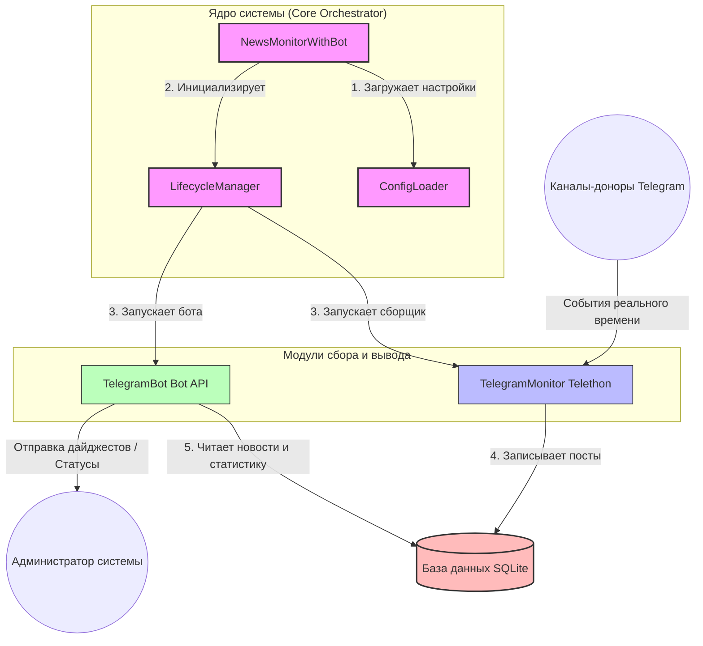

## 1.4 Общая архитектура системы сбора данных

### 1.4.1 Принципы асинхронного взаимодействия компонентов
Современные информационные системы, работающие с социальными сетями и мессенджерами, должны обрабатывать огромные потоки информации в режиме реального времени. В Telegram новые публикации в каналах могут появляться каждую секунду, а пользователи и администраторы бота могут отправлять команды в любой момент. Если бы наше приложение обрабатывало каждое действие строго по очереди (синхронно), то при получении длинного текста или при задержке сети вся система бы «зависала», пропуская новые посты.

Чтобы избежать подобных проблем, архитектура системы сбора данных построена на принципе **асинхронности** с использованием стандартной библиотеки Python `asyncio`. 

Простыми словами о сложном: асинхронность можно сравнить с работой шеф-повара на кухне. Вместо того чтобы стоять у плиты и бездействовать, пока закипает вода для пасты (синхронный подход), повар параллельно режет овощи и подготавливает соус (асинхронный подход). В нашей системе программа не ждет, пока Telegram ответит на запрос или база данных запишет файл на диск, а мгновенно переключается на обработку других задач.

Взаимодействие компонентов системы координируется главным оркестратором — **ядром (Core)**, которое связывает воедино сборщик новостей, базу данных и интерфейс Telegram-бота.

### 1.4.2 Роль ядра, клиента и бота в архитектуре системы
Архитектура системы состоит из трех ключевых модулей, работающих параллельно в рамках одного асинхронного процесса:

1. **Ядро системы (Core / Главный оркестратор)**
   Представлено классом `NewsMonitorWithBot`. Оно выступает в роли «дирижера» всего приложения. Ядро отвечает за:
   * Загрузку и проверку конфигурации из файлов настроек (`ConfigLoader`);
   * Безопасный запуск и корректное завершение работы всех компонентов (`LifecycleManager`);
   * Управление перезапусками и защиту от сбоев (например, контроль лимитов запросов Telegram и проверка файла-блокиратора `STOP_BOT`, который останавливает систему при необходимости);
   * Маршрутизацию собранных сообщений (определение региона новости и отправка в соответствующие темы целевой группы).

2. **Клиент сбора данных (TelegramMonitor)**
   Этот модуль работает на базе библиотеки `Telethon` и использует протокол MTProto (официальный протокол Telegram для клиентских приложений). Он выполняет роль «глаз» системы:
   * Авторизуется под видом обычного пользователя (User-аккаунт), что позволяет ему читать любые открытые каналы без ограничений, накладываемых на стандартных ботов;
   * В реальном времени отслеживает появление новых постов в каналах-донорах;
   * Асинхронно считывает текст постов, количество просмотров, реакций, пересылок и метаданные медиафайлов;
   * Передает «сырые» данные модулю обработки для очистки текста от HTML-тегов, рекламы и определения региона.

3. **Telegram-бот управления (TelegramBot)**
   Этот модуль взаимодействует с официальным Telegram Bot API. Он служит «интерфейсом» для администраторов и пользователей:
   * Принимает команды управления (например, запуск ручной проверки, получение текущего статуса работы, управление фильтрами);
   * Формирует и отправляет ежедневные или периодические дайджесты новостей;
   * Запускается как отдельная фоновая задача (`asyncio.create_task`) и никак не мешает процессу сбора данных.

### 1.4.3 Схема взаимодействия компонентов системы
Связующим звеном между всеми компонентами является локальная база данных. Клиент сбора данных только записывает новые посты, а Telegram-бот считывает их оттуда для генерации отчетов или отображения статистики. Такая схема (рисунок 1.1) исключает прямую зависимость модулей друг от друга, делая систему надежной.


*Рисунок 1.1 — Схема асинхронного взаимодействия компонентов системы*

Благодаря использованию `asyncio` все эти действия происходят параллельно. Бот мгновенно отвечает администратору на команду `/status`, даже если в этот же момент клиент `TelegramMonitor` скачивает большой пакет новостей из двадцати разных каналов.

---

## 1.5 Спецификация данных и проектирование базы данных

### 1.5.1 Обоснование выбора СУБД SQLite и библиотеки aiosqlite
Для хранения собранных новостей, информации о каналах-донорах и ежедневной статистики была выбрана встраиваемая система управления базами данных **SQLite**. 

Основные причины выбора SQLite для данной курсовой работы:
1. **Простота и отсутствие накладных расходов**. SQLite не требует установки отдельного сервера базы данных (как PostgreSQL или MySQL). Вся база данных хранится в одном локальном файле на диске (`news_monitor.db`). Это идеальное решение для развертывания на недорогих виртуальных серверах (VPS) с жесткими лимитами оперативной памяти (например, 1 ГБ ОЗУ).
2. **Высокая скорость работы**. Поскольку СУБД работает напрямую с файлом в адресном пространстве программы (без сетевых запросов к внешнему серверу БД), локальные операции чтения и записи выполняются практически мгновенно.
3. **Портативность**. Перенести всю базу данных со всеми данными на другой сервер или компьютер можно простым копированием одного файла `news_monitor.db`.

Однако у классической SQLite есть весомый минус: она работает в синхронном режиме. Если программа выполняет сложный поисковый запрос к базе, основной поток Python замирает (блокируется), ожидая ответа от диска. Для асинхронного приложения это недопустимо.

Чтобы решить эту проблему, в проекте используется библиотека **`aiosqlite`**. Она запускает синхронные операции с SQLite в отдельном фоновом потоке, а для основного кода приложения предоставляет удобный асинхронный интерфейс с ключевыми словами `await`. Таким образом, запись новой новости в базу данных происходит незаметно для работы Telegram-бота и не вызывает «зависаний» интерфейса.

### 1.5.2 Физическое проектирование: SQL-структура таблиц
В базе данных `news_monitor.db` спроектированы четыре основные таблицы. Ниже приведены SQL-запросы для их создания (`CREATE TABLE`) с подробным описанием структуры.

#### 1. Основная таблица новостей (`messages`)
Таблица предназначена для хранения собранных новостных постов, их региональной привязки, метрик популярности и результатов автоматического анализа искусственным интеллектом (AI).

```sql
CREATE TABLE IF NOT EXISTS messages (
    id TEXT PRIMARY KEY,                       -- Уникальный текстовый ID сообщения
    channel_username TEXT NOT NULL,            -- Юзернейм канала в Telegram (например, @news_prim)
    channel_name TEXT,                         -- Понятное человеку название канала
    channel_region TEXT,                       -- Регион новости (например, kamchatka, sakhalin)
    channel_category TEXT,                     -- Тематическая категория канала
    message_id INTEGER,                        -- Порядковый ID сообщения внутри самого Telegram
    text TEXT,                                 -- Полный текст новости после очистки
    date TIMESTAMP,                            -- Дата и время публикации новости автором
    views INTEGER DEFAULT 0,                   -- Количество просмотров поста
    forwards INTEGER DEFAULT 0,                -- Количество пересылок поста
    replies INTEGER DEFAULT 0,                 -- Количество комментариев/ответов под постом
    reactions_count INTEGER DEFAULT 0,          -- Общее количество реакций на посте (эмодзи)
    url TEXT,                                  -- Прямая ссылка на сообщение в Telegram
    content_hash TEXT UNIQUE,                  -- SHA-256 хэш контента для исключения дубликатов
    processed BOOLEAN DEFAULT FALSE,           -- Флаг: обработан ли пост фильтрами
    ai_score INTEGER DEFAULT 0,                -- Оценка важности новости от ИИ (от 0 до 100)
    ai_analysis TEXT,                          -- Подробный анализ ИИ в формате JSON (ключевые слова, краткая суть)
    ai_suitable BOOLEAN DEFAULT FALSE,          -- Флаг: подходит ли новость для итоговой публикации
    ai_priority TEXT DEFAULT 'low',            -- Приоритет новости ('low', 'medium', 'high')
    selected_for_output BOOLEAN DEFAULT FALSE,  -- Выбрана ли новость для включения в дайджест
    created_at TIMESTAMP DEFAULT CURRENT_TIMESTAMP, -- Время добавления записи в нашу базу
    updated_at TIMESTAMP DEFAULT CURRENT_TIMESTAMP  -- Время последнего обновления записи
);
```

#### 2. Состояние проверок каналов (`channel_checks`)
Таблица используется для контроля процесса мониторинга. Она позволяет фиксировать, на каком моменте остановилась проверка каждого конкретного канала.

```sql
CREATE TABLE IF NOT EXISTS channel_checks (
    channel_username TEXT PRIMARY KEY,         -- Юзернейм проверяемого канала
    last_check_time TIMESTAMP,                 -- Дата и время последней успешной проверки
    last_message_id INTEGER,                   -- ID последнего прочитанного сообщения в этом канале
    messages_processed INTEGER DEFAULT 0,      -- Всего успешно обработанных постов из канала
    errors_count INTEGER DEFAULT 0,            -- Количество ошибок подключения к каналу
    created_at TIMESTAMP DEFAULT CURRENT_TIMESTAMP,
    updated_at TIMESTAMP DEFAULT CURRENT_TIMESTAMP
);
```

#### 3. Предотвращение повторных публикаций (`processed_hashes`)
Данная таблица необходима для работы алгоритма дедупликации (борьбы с копированием новостей в разных источниках).

```sql
CREATE TABLE IF NOT EXISTS processed_hashes (
    content_hash TEXT PRIMARY KEY,             -- SHA-256 хэш текста новости
    first_seen TIMESTAMP DEFAULT CURRENT_TIMESTAMP, -- Время, когда новость встретилась впервые
    count INTEGER DEFAULT 1                    -- Сколько раз данная новость дублировалась в других каналах
);
```

#### 4. Ежедневная статистика работы (`statistics`)
Таблица накапливает метрики эффективности системы для формирования отчетов администратору.

```sql
CREATE TABLE IF NOT EXISTS statistics (
    id INTEGER PRIMARY KEY AUTOINCREMENT,      -- Порядковый номер записи
    date DATE UNIQUE,                          -- Дата, за которую собрана статистика
    total_messages INTEGER DEFAULT 0,          -- Всего обнаружено сообщений за сутки
    processed_messages INTEGER DEFAULT 0,      -- Успешно обработано и отфильтровано постов
    selected_messages INTEGER DEFAULT 0,       -- Отобрано важных новостей для вывода
    ai_requests INTEGER DEFAULT 0,             -- Сделано запросов к API нейросети
    tokens_used INTEGER DEFAULT 0,             -- Количество потраченных токенов нейросети
    channels_checked INTEGER DEFAULT 0,        -- Сколько уникальных каналов проверено за сутки
    errors_count INTEGER DEFAULT 0,            -- Общее количество ошибок в системе за сутки
    created_at TIMESTAMP DEFAULT CURRENT_TIMESTAMP
);
```

### 1.5.3 Назначение ключевых полей базы данных
Для эффективной работы системы критически важны следующие поля:
* **`id` в таблице `messages`**: Формируется как комбинация юзернейма канала и ID сообщения в Telegram (например, `news_prim_12345`). Это гарантирует уникальность каждой записи и предотвращает повторное сохранение одного и того же поста при повторном сканировании канала.
* **`content_hash`**: Уникальный текстовый SHA-256 хэш, генерируемый на основе текста новости. При сохранении нового сообщения система проверяет наличие такого же хэша в таблице `processed_hashes`. Если хэш уже существует, сообщение признается дубликатом (репостом или плагиатом) и отбрасывается, не попадая в итоговую ленту новостей.
* **`channel_region`**: Текстовое поле, хранящее название региона, к которому относится новость (например, `primorye`, `kamchatka`). Наличие этого поля позволяет делать быструю выборку новостей по конкретному субъекту РФ для формирования региональных дайджестов.
* **`last_message_id`**: Хранит номер последнего успешно прочитанного сообщения в Telegram-канале. При следующем сеансе сканирования клиент `TelegramMonitor` считывает только сообщения с ID, которые строго больше этого значения. Это сводит к минимуму сетевой трафик и нагрузку на сервер.
* **`selected_for_output`**: Логический флаг (булево значение). Когда модуль сортировки одобряет новость как важную, этот флаг устанавливается в значение `True`. Telegram-бот делает выборку только по этому флагу при отправке свежих новостей пользователям.
* **Группа полей ИИ-анализа (`ai_suitable`, `ai_score`, `ai_analysis`, `ai_priority`)**: Это специальные **архитектурные заготовки для будущей интеграции системы с локальной нейросетью** (LLM). В текущей продакшн-версии в целях оптимизации ресурсов сервера (минимизации ОЗУ и CPU на слабом VPS) прямой вызов ИИ-модели отключен, а поля принимают значения по умолчанию (например, `ai_suitable` = `False`, `ai_priority` = `'low'`). При этом вся структура базы данных на 100% готова к подключению нейросети без изменения схемы данных, а текущий отбор новостей успешно работает на каскадных алгоритмах по флагу `selected_for_output`.

### 1.5.4 Индексы для оптимизации поиска
Для того чтобы база данных работала быстро даже при наличии сотен тысяч записей, были созданы индексы. 

*Простыми словами о сложном:* индекс в базе данных — это как алфавитный предметный указатель в конце толстого учебника. Без указателя вам пришлось бы перелистывать всю книгу страница за страницей, чтобы найти термин (это называется полным сканированием таблицы). С указателем вы сразу видите номера страниц и мгновенно переходите к нужной информации.

В проекте используются следующие индексы:
```sql
CREATE INDEX IF NOT EXISTS idx_messages_channel ON messages(channel_username);
CREATE INDEX IF NOT EXISTS idx_messages_date ON messages(date);
CREATE INDEX IF NOT EXISTS idx_messages_score ON messages(ai_score);
CREATE INDEX IF NOT EXISTS idx_messages_selected ON messages(selected_for_output);
CREATE INDEX IF NOT EXISTS idx_hash_lookup ON processed_hashes(content_hash);
```
Индексы построены по полям, которые чаще всего участвуют в поисковых запросах (фильтрация по дате, выборка новостей по юзернейму канала, поиск по оценке важности ИИ и проверка хэшей для дедупликации).

### 1.5.5 Оптимизация SQLite под ограничения виртуального сервера (VPS)
Для обеспечения максимальной производительности СУБД SQLite на сервере с ограниченными аппаратными ресурсами (малый объем оперативной памяти, медленный диск) в классе `DatabaseManager` при инициализации соединения выполняются специальные оптимизирующие настройки (команды `PRAGMA`):

1. **Режим WAL (Write-Ahead Logging / Запись вперед)**:
   ```sql
   PRAGMA journal_mode = WAL;
   ```
   По умолчанию SQLite при записи блокирует всю базу данных, из-за чего другие потоки не могут даже читать информацию. В режиме WAL все изменения сначала записываются в отдельный быстрый файл-журнал, а уже потом переносятся в основную базу. Это позволяет процессам чтения и записи выполняться **одновременно**. Клиент мониторинга может непрерывно записывать новые сообщения, а бот в этот же момент будет свободно читать данные для пользователей без блокировок («Database is locked»).

2. **Безопасная синхронизация NORMAL**:
   ```sql
   PRAGMA synchronous = NORMAL;
   ```
   В стандартном режиме СУБД после каждой записи жестко требует от операционной системы физически записать данные на диск, что сильно замедляет работу из-за медленных дисков на VPS. Режим `NORMAL` разрешает SQLite переносить данные на диск реже, используя системный кэш. Это ускоряет пакетную вставку данных в 5–10 раз, при этом база данных остается полностью защищенной от повреждений при сбоях самого приложения.

3. **Ограничение кэша до 10 Мегабайт**:
   ```sql
   PRAGMA cache_size = 10000;
   ```
   Эта команда указывает СУБД использовать фиксированный размер кэша в оперативной памяти (10 000 страниц, что эквивалентно примерно 10 МБ). Такого объема достаточно для хранения в ОЗУ всех индексов и часто запрашиваемых данных, что исключает лишние обращения к диску. При этом гарантируется, что база данных не начнет бесконтрольно потреблять драгоценную оперативную память сервера.

4. **Хранение временных таблиц в оперативной памяти**:
   ```sql
   PRAGMA temp_store = MEMORY;
   ```
   При сортировке больших объемов данных (например, при поиске топ-10 новостей за неделю) SQLite может создавать временные служебные таблицы. Данная настройка заставляет СУБД создавать их исключительно в оперативной памяти, а не на жестком диске VPS, что существенно ускоряет выполнение сложных аналитических запросов.

Такой комплекс архитектурных и низкоуровневых решений позволил создать быструю, надежную и нетребовательную к ресурсам систему сбора новостей, идеально подходящую для работы на доступных виртуальных серверах.
