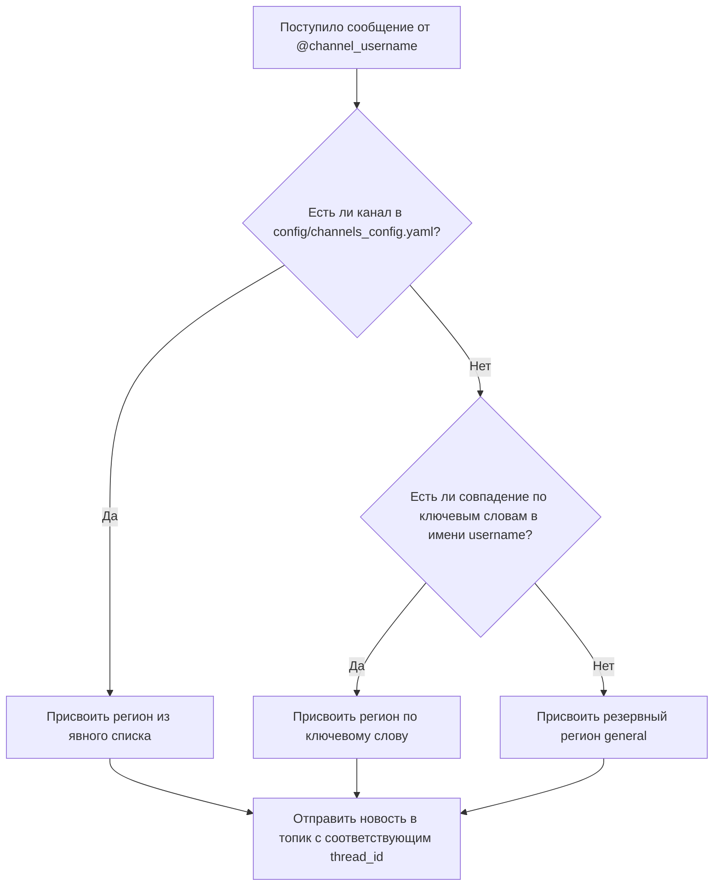

## 2.4 Алгоритм региональной сортировки и классификации

Одной из ключевых задач разработанного модуля является автоматическое распределение собранных новостей по конкретным географическим регионам Дальнего Востока РФ. Это позволяет структурировать новостной поток и доставлять информацию пользователям в удобном виде.

Вместо сложного и требовательного к ресурсам семантического анализа текста с применением искусственного интеллекта на первом этапе (что замедлило бы обработку и потребовало больших мощностей), в системе реализован высокопроизводительный гибридный алгоритм региональной классификации. Этот алгоритм встроен в основной цикл обработки сообщений и выполняется мгновенно.

### Логика работы алгоритма (метод `get_channel_regions`)

Алгоритм определения региона канала-донора (метод `get_channel_regions`, реализованный в главном файле приложения `src/core/app.py`) работает по принципу каскадного перебора с тремя уровнями приоритета. Это гарантирует высокую точность и устойчивость к ошибкам.

Схема работы алгоритма представлена ниже:


*Рисунок 2.1 — Блок-схема алгоритма распределения новостей по регионам*

Рассмотрим подробно каждый из трех приоритетов алгоритма:

1. **Приоритет 1: Явное сопоставление (Конфигурационный файл `config/channels_config.yaml`)**  
   Это самый надежный способ классификации. При запуске и работе система считывает файл явного сопоставления каналов регионам. В этом файле администратор системы заранее прописывает, какие каналы жестко относятся к конкретным регионам.  
   Пример структуры файла:
   ```yaml
   regions:
     kamchatka:
       name: 🌋 Камчатка
       channels:
         - title: ИА Кам24
           username: IA_Kam24
     sakhalin:
       name: 🏝️ Сахалин
       channels:
         - title: АСТВ
           username: astv_ru
   ```
   Если имя пользователя канала (`channel_username`), от которого пришла новость, найдено в списке какого-либо региона в файле `channels_config.yaml`, алгоритм сразу же возвращает этот регион и прекращает дальнейшие проверки. Это исключает любые ложноположительные срабатывания для проверенных источников.

2. **Приоритет 2: Автоматический поиск по ключевым словам (keywords в `config.yaml`)**  
   Если канала-донора нет в списке явного сопоставления (например, его только что добавили через бота, или это новый источник), система применяет автоматический поиск по ключевым словам.  
   Для этого из общего конфигурационного файла `config.yaml` загружаются слова-маркеры для каждого региона:
   * **Чита**: `чита`, `chita`, `забайкалье`, `забайкальский`, `75` и др.
   * **Камчатка**: `камчатка`, `kamchatka`, `петропавловск`, `41`, `kam` и др.
   * **Сахалин**: `сахалин`, `sakhalin`, `курилы`, `65` и др.
   * **Якутск**: `якутск`, `yakutsk`, `якутия`, `саха`, `14` и др.
   
   Алгоритм переводит `channel_username` в нижний регистр и проверяет, входит ли какое-либо из ключевых слов региона в это имя. Например, канал с именем `@chp_kamchatka` автоматически получит регион `kamchatka`, так как в его названии содержится слово `kamchatka`.

3. **Приоритет 3: Резервный регион (Fallback — `general`)**  
   Если канал не найден в файле сопоставления и его имя не содержит никаких ключевых слов (например, новостной канал с абстрактным названием `@r2d2sakh` или `@amur_mash`), система присваивает ему категорию `general` (общая лента). Это гарантирует, что ни одна новость не потеряется, даже если её региональную принадлежность не удалось определить автоматически.

### Сортировка по топикам в целевой группе

После того как регион сообщения успешно определен, модуль мониторинга должен переслать новость в соответствующий поток. В качестве приемника новостей используется Telegram-группа, переведенная в режим форума (с темами/топиками).

В конфигурационном файле `config.yaml` в блоке `output: topics` каждому региону сопоставлен уникальный идентификатор темы (`thread_id`):
```yaml
output:
  target_group: -100123456789  # ID целевой группы-форума
  topics:
    kamchatka: 5               # Новости Камчатки отправляются в тему ID 5
    sakhalin: 2                # Новости Сахалина отправляются в тему ID 2
    chita: 32                  # Новости Читы отправляются в тему ID 32
    vladivostok: 1020          # Новости Владивостока в тему ID 1020
    general: null              # Общие новости отправляются в основную тему
```

При вызове метода `send_message_to_target` программа:
1. Получает регион канала (например, `kamchatka`).
2. Находит для него `thread_id` из настроек (в данном случае `5`).
3. Формирует красивое текстовое сообщение (очищенное от лишней разметки, со ссылкой на оригинальный источник и указанием даты).
4. Отправляет его в группу `target_group` строго в тему с ID `5` с помощью асинхронного вызова API Telegram.

Благодаря этому решению пользователи целевой группы видят четко структурированные по региональным вкладкам новости Дальнего Востока, а не хаотичный поток сообщений.

---

## 2.5 Алгоритмы дедупликации и технической фильтрации

Поскольку модуль мониторинга отслеживает более 80 новостных Telegram-каналов одновременно, возникает проблема избыточности информации. Региональные каналы часто копируют новости друг у друга или делают репосты одной и той же важной информации. Без механизмов фильтрации целевой канал быстро заполнился бы одинаковыми сообщениями (спамом), что снизило бы его ценность для пользователей.

Для решения этой проблемы в проекте реализованы алгоритмы дедупликации текстового контента и технической фильтрации медиафайлов.

### Алгоритм дедупликации на основе SHA-256 хэширования

Для выявления повторов новостей используется криптографический алгоритм хэширования **SHA-256** (Secure Hash Algorithm 256-bit). 

> **Простое объяснение:** Хэширование — это математическое преобразование любого текста (даже очень длинного) в уникальную строку фиксированной длины (64 символа в шестнадцатеричном формате). Эта строка является своеобразным «цифровым отпечатком пальца» текста. Если два текста абсолютно одинаковы, их хэши совпадут. Но если изменить в тексте хотя бы одну букву или знак препинания, хэш изменится до неузнаваемости.

Логика работы механизма дедупликации состоит из следующих этапов:

1. **Формирование строки контента**  
   При получении нового сообщения от канала-донора класс `MessageProcessor` (файл `src/monitoring/message_processor.py`) извлекает текст сообщения и имя канала-источника. Из них формируется строка для анализа:
   ```python
   content = f"{channel_username}:{message.text}"
   ```
   Добавление `channel_username` позволяет различать одинаковые сообщения, если они целенаправленно публикуются одним и тем же каналом, но предотвращает повторную публикацию, если новость копируется другими каналами.

2. **Генерация уникального хэша**  
   С помощью стандартной библиотеки Python `hashlib` генерируется SHA-256 хэш:
   ```python
   content_hash = hashlib.sha256(content.encode('utf-8')).hexdigest()
   ```

3. **Проверка в базе данных и сохранение**  
   Система использует таблицу `processed_hashes` в базе данных SQLite. Схема таблицы представлена ниже:
   
   **Таблица `processed_hashes` (Дедупликация)**
   * `content_hash` (TEXT PRIMARY KEY) — уникальный хэш сообщения.
   * `first_seen` (TIMESTAMP) — дата и время первого обнаружения сообщения.
   * `count` (INTEGER) — счетчик того, сколько раз эта новость встретилась в других источниках.

   Перед сохранением новости в базу данных `messages` и её пересылкой в целевую группу выполняется быстрая проверка:
   ```sql
   SELECT id FROM messages WHERE content_hash = ?
   ```
   * **Если хэш уже существует в БД:** Сообщение признается дубликатом. Система увеличивает счетчик повторений в таблице хэшей на единицу (`count = count + 1`) для ведения статистики популярности новости, но само сообщение **отбрасывается** и не публикуется в целевой группе.
   * **Если хэша в БД нет:** Сообщение уникально. Оно сохраняется в базу данных, хэш записывается в таблицу `processed_hashes`, а новость отправляется в целевую группу.

Благодаря этому алгоритму полностью исключается повторная публикация одинаковых новостей в группах мониторинга.

### Техническая фильтрация медиа-групп (альбомов)

Еще одна техническая сложность работы с Telegram API заключается в обработке медиа-групп (альбомов из нескольких фотографий или видео). 

В Telegram сообщения с несколькими картинками отправляются в виде отдельных событий для каждого медиафайла, но все они содержат один и тот же уникальный идентификатор группы `grouped_id` (параметр сообщения).

Если бы бот обрабатывал каждое событие независимо, он бы:
1. Получил первое фото с текстом описания и отправил его в целевую группу.
2. Получил второе фото (которое технически идет как отдельное сообщение с тем же текстом) и снова отправил бы этот текст в целевую группу.
3. В результате пользователи получили бы 5 одинаковых постов с текстом для альбома из 5 фотографий.

Для предотвращения этого в `MessageProcessor` реализован кэш в оперативной памяти на основе структуры данных `Set` (множество):
```python
self.processed_media_groups: Set[int] = set()
```

**Алгоритм обработки медиа-групп:**
1. При получении сообщения система проверяет, содержит ли оно медиафайлы и имеет ли параметр `grouped_id`.
2. Если `grouped_id` присутствует, программа проверяет его наличие во множестве `processed_media_groups`.
3. Если этот идентификатор уже находится во множестве, это означает, что первая фотография из этого альбома уже обработана и отправлена. Текущее сообщение **пропускается (игнорируется)**.
4. Если идентификатора в кэше нет, он добавляется в `processed_media_groups`, а сообщение с текстом отправляется дальше по циклу обработки.
5. Для экономии оперативной памяти сервера при превышении размера множества в 1000 элементов кэш автоматически очищается методом `clear()`.

Этот простой асинхронный фильтр гарантирует, что альбомы пересылаются в целевой канал один раз, не создавая визуального мусора.

---

## 2.6 Оптимизация производительности при высокой нагрузке

Мониторинг более 80 новостных Telegram-каналов в режиме реального времени накладывает жесткие требования к производительности программного обеспечения. Сервер, на котором разворачивается подобный бот (обычно это бюджетный VPS с 1 CPU и 1 ГБ оперативной памяти), имеет ограниченные ресурсы. 

Кроме того, сам Telegram накладывает суровые ограничения на количество запросов к своему API (Rate Limits). За слишком частые запросы к серверам Telegram аккаунт бота или клиента может быть временно заблокирован на срок от нескольких минут до нескольких дней (ошибка Flood Wait).

В ходе разработки модуля мониторинга был применен комплекс мер по оптимизации производительности и защиты от блокировок.

### Режим быстрого старта (`fast_start_mode`) и кэширование подписок

Основная проблема асинхронной библиотеки Telethon при работе с большим списком каналов — это процесс инициализации (подписки на каналы при запуске).

* **Как было без оптимизации:** При каждом запуске бот опрашивал Telegram API для каждого из 80+ каналов, проверяя, подписан ли аккаунт на этот источник. На один запрос уходило около 2–3 секунд с учетом сетевых задержек. Из-за ограничений Telegram API на частоту запросов система быстро получала предупреждения и принудительно засыпала. В итоге холодный старт системы занимал **от 15 до 30 минут**.
* **Как реализовано с оптимизацией:** Разработан модуль `SubscriptionCacheManager` (файл `src/monitoring/subscription_cache.py`), который сохраняет состояние подписок в локальный JSON-файл `config/subscriptions_cache.json`.

При первой успешной подписке на канал его `username` записывается в локальный кэш-файл на сервере. При последующих перезапусках системы бот активирует режим **`fast_start_mode = True`** и выполняет алгоритм:
1. Загружает список каналов из локального файла кэша подписок (это происходит мгновенно за доли миллисекунды без сетевых запросов).
2. Разделяет общий список каналов на две категории: «кешированные» (уже подтвержденные ранее) и «новые» (добавленные недавно).
3. Для кешированных каналов система сразу получает их внутренние идентификаторы (`entity`) из локальной базы данных сессии Telethon, минуя вызовы проверок подписки через Telegram API. Задержка между обработкой таких каналов составляет всего **1 секунду** (`delay_cached_channel = 1`).
4. Медленной проверке подвергаются только новые каналы, которых еще нет в кэше.

Благодаря кэшированию время запуска системы с 80+ каналами сократилось с **30 минут до 30 секунд** (ускорение в 60 раз!), а нагрузка на Telegram API в момент старта снизилась до минимума.

### Таймауты и пакетная обработка (батчинг)

Для того чтобы процесс подключения к новым каналам выглядел для систем безопасности Telegram как естественные действия человека, в классе `ChannelMonitor` (файл `src/monitoring/channel_monitor.py`) реализован алгоритм пакетной обработки каналов (батчинг) с системой индивидуальных таймаутов.

Все настройки таймаутов гибко управляются через файл конфигурации `config.yaml` в блоке `monitoring: timeouts`:

```yaml
monitoring:
  timeouts:
    batch_size: 6                  # Каналов в одном пакете
    delay_cached_channel: 1        # Пауза для кешированных каналов (сек)
    delay_already_joined: 2        # Пауза для уже подписанных каналов (сек)
    delay_verification: 3          # Время на верификацию подписки (сек)
    delay_after_subscribe: 5       # Пауза после новой подписки (сек)
    delay_between_batches: 8       # Отдых между пакетами (сек)
    delay_retry_wait: 300          # Ожидание при блокировке (сек)
```

**Алгоритм пакетной обработки:**
1. Новые каналы делятся на небольшие пакеты размером по `batch_size = 6` каналов в каждом.
2. Внутри пакета бот обрабатывает каналы поочередно. После подписки на очередной канал он делает обязательную паузу в `delay_after_subscribe = 5` секунд и трижды с интервалом в `delay_verification = 3` секунды проверяет успешность операции.
3. Обработав один пакет (6 каналов), бот делает длительную паузу «отдыха» — `delay_between_batches = 8` секунд.
4. Только после этого начинается обработка следующего пакета.

Такой прерывистый ритм работы полностью предотвращает срабатывание автоматических систем защиты Telegram от спам-скриптов.

### Защита от блокировок Flood Wait

Если в процессе работы сервер все же сталкивается с перегрузкой запросов или временным ограничением от Telegram API, библиотека Telethon выбрасывает исключение `FloodWaitError`. В большинстве простых скриптов это приводит к падению программы.

В разработанном модуле реализована интеллектуальная система перехвата и обработки этой ошибки:

1. Блок обработки подписок обернут в конструкцию `try...except FloodWaitError`.
2. При возникновении ошибки управление передается вспомогательному методу `_extract_wait_time`, который с помощью регулярных выражений парсит текст ошибки:
   ```python
   match = re.search(r'wait of (\d+) seconds', error_message)
   ```
3. Метод извлекает точное число секунд, на которое Telegram заблокировал запросы (например, 180 секунд).
4. Программа выводит в лог предупреждение о блокировке и автоматически приостанавливает свою работу с помощью асинхронного сна:
   ```python
   await asyncio.sleep(wait_seconds)
   ```
5. Дополнительно в коде установлена верхняя граница ожидания — `delay_retry_wait = 300` секунд (5 минут). Если Telegram требует ждать слишком долго (например, несколько часов при длительной блокировке аккаунта), система не зависает навсегда, а делает паузу в 5 минут, отправляет администратору предупреждение об опасности через бота (`send_error_alert`) и пытается аккуратно продолжить мониторинг других задач.

Использование асинхронных таймаутов, локального кэширования подписок и пакетной обработки позволило создать стабильное, высокопроизводительное приложение, способное бесперебойно работать в режиме 24/7 на дешевом серверном оборудовании.

---

# Заключение

В ходе выполнения курсовой работы был успешно разработан и протестирован программный модуль мониторинга Telegram-каналов для автоматического сбора и региональной сортировки новостей Дальневосточного региона РФ.

Все поставленные во введении цели и задачи были полностью выполнены:
1. **Проведен анализ протоколов взаимодействия с API Telegram**: изучены принципы работы протокола MTProto и возможности асинхронной библиотеки Telethon для эффективного сбора данных в реальном времени.
2. **Спроектирована архитектура системы и схема базы данных**: в качестве хранилища выбрана легковесная база данных SQLite. Для оптимизации скорости записи и чтения в условиях ограниченных ресурсов VPS-сервера был успешно внедрен режим журналирования WAL (Write-Ahead Logging), а также настроены эффективные индексы для ускорения выборок по датам и популярности новостей.
3. **Реализован модуль асинхронного клиента**: разработан и внедрен `TelegramMonitor` для стабильного параллельного подключения к десяткам каналов-источников без блокировки основного потока приложения.
4. **Разработаны алгоритмы первичной обработки текста**: созданы механизмы очистки текстового содержимого от лишней разметки, Markdown-символов, извлечения метаданных сообщений (просмотры, пересылки, реакции) и формирования прямых ссылок на публикации.
5. **Создан алгоритм региональной классификации**: разработан и запрограммирован гибридный алгоритм `get_channel_regions`. Благодаря каскадной структуре приоритетов (конфигурационные списки, поиск по ключевым словам и резервный fallback) система безошибочно сортирует новости по региональным веткам целевой группы-форума.
6. **Реализован механизм дедупликации и фильтрации**: внедрена система SHA-256 хэширования текстового контента, отсекающая повторные публикации новостей СМИ в режиме реального времени, а также реализован оперативный кэш медиа-групп для корректного отображения фотоальбомов.
7. **Проведена оптимизация производительности**: благодаря разработке менеджера кэша подписок `SubscriptionCacheManager` и внедрению режима `fast_start_mode` время запуска бота сократилось с 30 минут до 30 секунд. Использование пакетного батчинга и перехвата ошибок `FloodWaitError` гарантирует надежную защиту от блокировок со стороны Telegram API.

### Практическая значимость работы

Разработанный модуль представляет собой законченный инструмент автоматизации работы новостных редакторов, администраторов региональных сообществ и специалистов по мониторингу СМИ. Проект спроектирован с учетом развертывания на маломощных и бюджетных серверах VPS, не требует абонентской платы за использование сторонних API и легко масштабируется за счет добавления новых регионов и каналов-доноров через простые файлы конфигурации YAML.

Созданная система позволяет централизованно аккумулировать информационную картину дня Дальнего Востока, оперативно выявлять экстренные события с помощью встроенного модуля алертов и автоматически группировать новости по темам, освобождая человека от рутинного ручного отслеживания десятков первоисточников.

---

# Список литературы

1. Фаулер, М. Asyncio и конкурентное программирование на Python / М. Фаулер ; пер. с англ. – Москва : ДМК Пресс, 2023. – 396 с.
2. Митчелл, Р. Скрапинг веб-сайтов с помощью Python. Сбор данных из современного интернета / Р. Митчелл ; пер. с англ. – Москва : ДМК Пресс, 2021. – 280 с.
3. Коннолли, Т. Базы данных. Проектирование, реализация и сопровождение. Теория и практика / Т. Коннолли, К. Бегг ; пер. с англ. – Москва : Вильямс, 2017. – 1440 с.
4. Рамальо, Л. Python. К вершинам мастерства / Л. Рамальо ; пер. с англ. – Москва : ДМК Пресс, 2016. – 768 с.
5. Свейгарт, Э. Автоматизация рутинных задач с помощью Python: практическое руководство для начинающих / Э. Свейгарт ; пер. с англ. – Москва : Вильямс, 2017. – 592 с.
6. Лутц, М. Изучаем Python. Том 1 / М. Лутц ; пер. с англ. – Санкт-Петербург : Диалектика, 2020. – 848 с.
7. Документация библиотеки Telethon. Версия 1.28 [Электронный ресурс] // Telethon Docs. – URL: https://docs.telethon.dev/.
8. Документация по СУБД SQLite. Режим WAL (Write-Ahead Logging) [Электронный ресурс] // SQLite.org. – URL: https://www.sqlite.org/wal.html.
9. Документация библиотеки PyYAML [Электронный ресурс] // PyYAML.org. – URL: https://pyyaml.org/wiki/PyYAMLDocumentation.
10. Асинхронная библиотека asyncio [Электронный ресурс] // Документация Python. – URL: https://docs.python.org/3/library/asyncio.html.
11. Библиотека логирования Loguru [Электронный ресурс] // GitHub. – URL: https://github.com/Delgan/loguru.

---

# Приложение А

**(обязательное)**

## Пошаговая инструкция по развертыванию и запуску системы мониторинга

Данное приложение содержит подробное руководство по подготовке окружения, настройке конфигурационных файлов и запуску программного комплекса на сервере под управлением ОС Linux (Ubuntu/Debian) или Windows.

### Шаг 1. Системные требования

Для стабильной работы системы мониторинга сервер должен соответствовать минимальным характеристикам:
* **Операционная система**: Linux (Ubuntu 20.04+, Debian 11+), macOS или Windows 10/11.
* **Процессор (CPU)**: 1 виртуальное ядро (vCPU) с тактовой частотой от 1.5 ГГц.
* **Оперативная память (RAM)**: не менее 512 МБ (рекомендуется 1 ГБ).
* **Свободное место на диске**: от 2 ГБ (для хранения SQLite базы данных новостей за 30 дней).
* **Интерпретатор**: Python версии **3.10** или выше.

---

### Шаг 2. Клонирование проекта и установка зависимостей

1. Перенесите файлы проекта на целевой сервер или склонируйте его с помощью Git:
   ```bash
   git clone https://github.com/your-repository/SMI_tg_bot.git
   cd SMI_tg_bot
   ```

2. Создайте изолированное виртуальное окружение Python (это необходимо для предотвращения конфликта версий библиотек):
   ```bash
   python3 -m venv venv
   ```

3. Активируйте созданное виртуальное окружение:
   * **На Linux / macOS:**
     ```bash
     source venv/bin/activate
     ```
   * **На Windows (PowerShell):**
     ```powershell
     .\venv\Scripts\Activate.ps1
     ```

4. Установите все необходимые внешние библиотеки, перечисленные в файле `requirements.txt`:
   ```bash
   pip install --upgrade pip
   pip install -r requirements.txt
   ```

---

### Шаг 3. Регистрация API ключей в Telegram

Поскольку система мониторинга работает через прямое клиентское подключение (MTProto API), необходимо зарегистрировать личное приложение в Telegram.

1. Перейдите на официальный портал разработчиков Telegram: https://my.telegram.org.
2. Авторизуйтесь под номером телефона, на который будет зарегистрирован аккаунт мониторинга (рекомендуется использовать отдельную SIM-карту).
3. Перейдите в раздел **«API development tools»**.
4. Заполните поля **«App title»** (название приложения, например, `NewsMonitor`) и **«Short name»** (короткое имя).
5. Нажмите кнопку **«Create application»**.
6. Сохраните полученные параметры:
   * **App api_id** (целое число, например: `12345678`)
   * **App api_hash** (строка из букв и цифр, например: `a1b2c3d4e5f6g7h8i9j0`)

Далее необходимо зарегистрировать самого управляющего бота:
1. Откройте Telegram и перейдите в диалог с официальным ботом @BotFather (https://t.me/BotFather).
2. Отправьте команду `/newbot` и следуйте инструкциям (задайте имя и уникальный username бота).
3. Скопируйте выданный **токен бота** (строка вида `5432109876:AAH_ExampleTokenText...`).

---

### Шаг 4. Настройка переменных окружения (файл `.env`)

В корневой директории проекта создайте текстовый файл с именем `.env` (обратите внимание, что имя начинается с точки и не имеет расширения). Этот файл хранит секретные ключи доступа и системные ID.

Заполните файл `.env` по следующему шаблону (подставив свои реальные данные без кавычек и пробелов по бокам от знака `=`):

```env
# Параметры авторизации Telegram клиента (получены на my.telegram.org)
TELEGRAM_API_ID=12345678
TELEGRAM_API_HASH=a1b2c3d4e5f6g7h8i9j0

# Токен управляющего Telegram-бота (получен от @BotFather)
BOT_TOKEN=5432109876:AAH_ExampleTokenText...

# ID аккаунта администратора бота (для получения уведомлений о статусе и ошибок)
# Узнать свой ID можно в Telegram у бота @userinfobot
BOT_CHAT_ID=987654321

# ID целевой группы-форума, куда бот будет пересылать отсортированные новости
# ВАЖНО: ID групп в Telegram всегда начинается со знака минус (например, -100...)
# Узнать ID группы можно, переслав любое сообщение из неё боту @ShowJsonBot
TARGET_GROUP_ID=-1009876543210

# Список ID пользователей (через запятую), которым разрешено управлять ботом
BOT_ALLOWED_USERS=987654321,123456789
```

---

### Шаг 5. Конфигурация источников (каналов-доноров)

Перед запуском системы необходимо настроить список отслеживаемых каналов и ключевые слова.

1. **Настройка основных параметров (`config/config.yaml`)**  
   Откройте файл `config/config.yaml`. Убедитесь, что в секции `output: topics` сопоставлены правильные ID тем вашего Telegram-форума. Если вы не хотите использовать разделение по темам, установите значения `null`:
   ```yaml
   output:
     topics:
       kamchatka: 5
       sakhalin: null  # Новости Сахалина будут отправляться в общую ленту
   ```

2. **Настройка каналов (`config/channels_config.yaml`)**  
   Заполните список каналов-источников для каждого региона. Указывайте строго `username` канала (без символа `@` и без ссылки `https://t.me/`):
   ```yaml
   regions:
     kamchatka:
       name: 🌋 Камчатка
       channels:
         - title: ИА Кам24
           username: IA_Kam24
         - title: ЧП Камчатка
           username: chpkamchatka
   ```

---

### Шаг 6. Первый запуск и авторизация аккаунта

При первом запуске системы Telegram потребует пройти однократную авторизацию для аккаунта клиента (так же, как при входе в обычное приложение).

1. Выполните команду запуска в консоли сервера:
   ```bash
   python main.py
   ```

2. На экране появится запрос на ввод номера телефона. Введите номер телефона аккаунта клиента в международном формате (например, `+79991234567`) и нажмите Enter.
3. Telegram отправит сервисный код подтверждения. Введите полученный код в консоли.
4. Если на аккаунте установлена двухфакторная аутентификация (облачный пароль), введите его в консоли.
5. После успешного входа в корне проекта в папке `sessions/` будет создан файл сессии `news_monitor_session.session`. В дальнейшем авторизация будет происходить автоматически с использованием этого файла.
6. Бот отправит администратору (в чат `BOT_CHAT_ID`) уведомление о переходе системы в рабочий режим: **«📊 Статус системы: Мониторинг Активен»**.

---

### Шаг 7. Управление системой через интерфейс бота

После запуска управление модулем мониторинга полностью осуществляется через чат с созданным Telegram-ботом.

**Основные команды администратора:**
* `/status` — Проверить общую работоспособность системы, узнать количество активных подписок в кэше, состояние мониторинга (активен/пауза) и время последнего собранного сообщения.
* `/channels` — Просмотреть структурированный список всех отслеживаемых каналов по регионам.
* `/force_subscribe` — Запустить принудительный медленный обход новых каналов из файлов конфигурации и добавить их в кэш подписок.
* `/restart` — Дистанционно перезапустить модуль мониторинга (применяется при изменении конфигурационных файлов без необходимости заходить на сервер по SSH).
* `/pause` / `/resume` — Временно приостановить или возобновить пересылку новостей в целевую группу.
