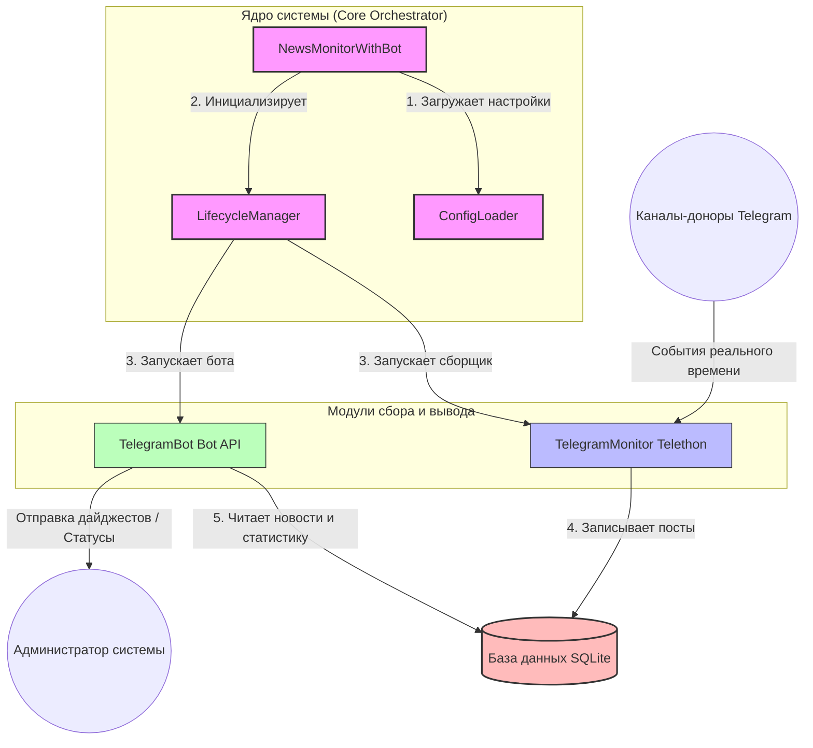
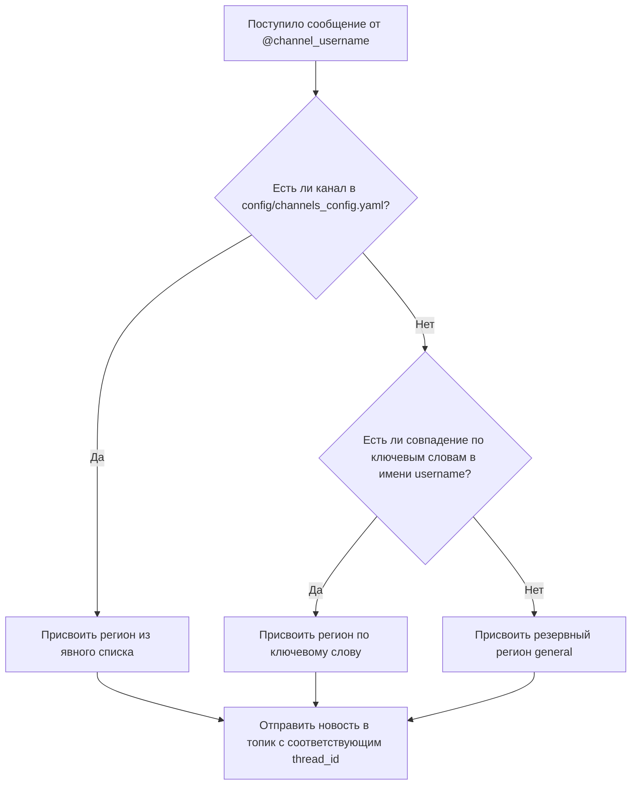

# МИНИСТЕРСТВО НАУКИ И ВЫСШЕГО ОБРАЗОВАНИЯ РОССИЙСКОЙ ФЕДЕРАЦИИ
# Федеральное государственное автономное образовательное учреждение высшего образования
# «Дальневосточный федеральный университет»
# (ДВФУ)
# 
# ШКОЛА ЦИФРОВОЙ ЭКОНОМИКИ
# Департамент прикладной информатики
# 
# 
# 
# **КУРСОВАЯ РАБОТА**
# 
# по дисциплине «Программирование на языке Python»
# 
# Тема: **«Разработка модуля мониторинга Telegram-бота для автоматического сбора и региональной сортировки новостей»**
# 
# 
# 
# Выполнил студент группы Б9123-09.03.03пикд:
# **Копаницкий Захар Александрович**
# 
# Руководитель ВКР:
# **П.Х. Ким**
# 
# 
# 
# 
# Владивосток, 2026
# 
# ---
# 
# ## Содержание
# 
# *   **[Введение](#введение)** ............................................................................................................ 3
# *   **[1 Проектирование системы](#1-проектирование-системы)** ................................................................................. 5
#     *   [1.1 Анализ предметной области и существующих решений](#11-анализ-предметной-области-и-существующих-решений) ........................................ 5
#     *   [1.2 Обоснование выбора методов и средств разработки](#12-обоснование-выбора-методов-и-средств-разработки) ............................................ 7
#     *   [1.3 Требования к аппаратному и программному окружению системы](#13-требования-к-аппаратному-и-программному-окружению-системы) ........................... 9
#     *   [1.4 Общая архитектура системы сбора данных](#14-общая-архитектура-системы-сбора-данных) ........................................................... 11
#     *   [1.5 Спецификация данных и проектирование базы данных](#15-спецификация-данных-и-проектирование-базы-данных) ......................................... 13
# *   **[2 Реализация проекта](#глава-2-реализация-проекта)** .................................................................................. 16
#     *   [2.1 Реализация клиента-сборщика реального времени](#21-реализация-клиента-сборщика-реального-времени) .......................................... 16
#     *   [2.2 Модуль первичной обработки новостей и парсинга](#22-модуль-первичной-обработки-новостей-и-парсинга) ........................................... 19
#     *   [2.3 Алгоритм очистки текста от форматирования](#23-алгоритм-очистки-текста-от-форматирования) .................................................... 22
#     *   [2.4 Алгоритм региональной сортировки и классификации](#24-алгоритм-региональной-сортировки-и-классификации) ........................................... 24
#     *   [2.5 Алгоритмы дедупликации и технической фильтрации](#25-алгоритмы-дедупликации-и-технической-фильтрации) ............................................ 27
#     *   [2.6 Оптимизация производительности при высокой нагрузке](#26-оптимизация-производительности-при-высокой-нагрузке) .................................... 30
# *   **[Заключение](#заключение)** ........................................................................................................ 33
# *   **[Список литературы](#список-литературы)** ................................................................................................ 34
# *   **[Приложение А. Руководство по развертыванию и запуску](#приложение-а-руководство-по-развертыванию-и-запуску)** .................................... 36
# 
# ---
# 
# 

# Введение

Современное информационное пространство характеризуется колоссальной скоростью распространения данных и ростом значимости альтернативных источников новостей, среди которых ключевое место занимает мессенджер Telegram. Благодаря простоте публикации контента, отсутствию жесткой цензуры и высокой оперативности Telegram стал основной платформой для работы региональных средств массовой информации (СМИ), ведомств, блогеров и очевидцев событий. 

Однако обилие источников порождает проблему переизбытка информации и так называемого «информационного шума». Для сотрудников пресс-служб, государственных ведомств, медиа-аналитиков и маркетологов ручной мониторинг десятков Telegram-каналов превращается в трудоемкую рутинную задачу. Аналитикам приходится тратить рабочее время на непрерывный просмотр новостных лент, ручную фильтрацию рекламы и спама, а также самостоятельную сортировку новостей по географическому признаку. В связи с этим возникает острая необходимость в автоматизации процессов сбора, фильтрации и региональной классификации новостного потока.

Курсовая работа посвящена разработке программного модуля мониторинга Telegram-бота, который в автоматическом режиме собирает сообщения из множества каналов-доноров, классифицирует их по региональной принадлежности и публикует в соответствующие тематические разделы целевой группы.

**Актуальность работы** заключается в высокой потребности региональных организаций и аналитических служб Дальнего Востока в оперативном получении структурированных новостей без значительных финансовых затрат. Существующие коммерческие платформы медиа-анализа (например, «Медиалогия» или специализированное платное API сервиса TGStat) требуют дорогостоящей подписки, обладают избыточным функционалом и не предоставляют готовых гибких инструментов для автоматической маршрутизации новостей по внутренним темам (топикам) Telegram-групп заказчика. Разрабатываемый модуль представляет собой доступное, гибкое и экономичное open-source решение, способное функционировать на серверах с минимальными аппаратными ресурсами и обеспечивать сбор и сортировку информации в реальном времени.

**Объект исследования** – процесс автоматического сбора, обработки и анализа информационных потоков (новостей) в мессенджере Telegram.

**Предмет исследования** – методы, алгоритмы и программные средства для асинхронного мониторинга каналов, извлечения метаданных сообщений, их дедупликации, фильтрации нерелевантного контента и классификации текстов по географическому признаку.

**Целью работы** является разработка эффективного и надежного модуля мониторинга Telegram-бота для автоматического асинхронного сбора новостей из каналов-доноров и их сортировки по регионам Дальневосточного федерального округа (ДФО) с последующей маршрутизацией в разделы целевой группы.

Для достижения поставленной цели необходимо решить следующие **задачи**:
1. Изучить протоколы взаимодействия с Telegram API (MTProto) и существующие методы автоматического сбора текстовых данных.
2. Спроектировать архитектуру программной системы и схему реляционной базы данных для эффективного хранения новостного потока и обеспечения дедупликации сообщений.
3. Разработать асинхронный модуль-клиент на языке Python для мониторинга каналов-доноров в реальном времени с поддержкой защитных механизмов от блокировок со стороны Telegram API.
4. Реализовать алгоритмы первичной обработки текстовой информации: очистку от лишних символов и ссылок, извлечение метаданных (просмотры, реакции, ответы, пересылки).
5. Разработать алгоритм региональной классификации новостей на основе анализа вхождения географических наименований и ключевых слов для субъектов ДФО.
6. Реализовать механизмы дедупликации сообщений на базе алгоритмов хэширования контента и технической фильтрации спама.
7. Оптимизировать производительность разрабатываемого модуля при работе с большим количеством источников с использованием механизмов кэширования подписок и оптимизации обращений к базе данных.

---

# 1 Проектирование системы

## 1.1 Анализ предметной области и существующих решений

Для организации оперативного мониторинга региональных новостей в Telegram можно использовать несколько подходов. Проведем сравнительный анализ существующих решений с целью выявления их преимуществ и недостатков по сравнению с разрабатываемой системой. В качестве альтернатив рассмотрим:
1. **Ручной мониторинг** – регулярный визуальный просмотр каналов силами сотрудников.
2. **Платформа TGStat** – крупнейший сервис аналитики Telegram-каналов, предоставляющий доступ к статистике и API.
3. **Система «Медиалогия»** – профессиональная коммерческая система мониторинга СМИ и социальных сетей.
4. **Разрабатываемое решение** – специализированный асинхронный модуль мониторинга с открытым исходным кодом.

Сравнительные характеристики указанных решений приведены в таблице 1.1.

Таблица 1.1 – Сравнительный анализ решений для мониторинга Telegram-каналов

| Критерий сравнения | Ручной мониторинг | TGStat | Система «Медиалогия» | Разрабатываемое решение |
| :--- | :--- | :--- | :--- | :--- |
| **Стоимость использования** | Бесплатно (но тратится рабочее время аналитиков) | Высокая стоимость доступа к API для непрерывного сбора | Очень высокая коммерческая стоимость подписки | Полностью бесплатно (требуются минимальные затраты на VPS) |
| **Скорость доставки новостей** | Низкая (зависит от человеческого фактора, возможны задержки) | Средняя (API имеет ограничения по частоте запросов в секунду) | Высокая (сбор происходит с задержкой в несколько минут) | Мгновенная (обработка в режиме реального времени за секунды) |
| **Региональная сортировка (ДФО)** | Ручная (определяется сотрудником визуально) | Отсутствует в автоматическом режиме (только общая география канала) | Ограниченная (по месту регистрации источника, а не по тексту сообщения) | Автоматическая (по ключевым словам в тексте новости для 6 регионов ДФО) |
| **Маршрутизация по топикам Telegram** | Ручное копирование и пересылка сообщений | Отсутствует | Отсутствует | Автоматическая (публикация в соответствующие разделы по topic_id) |
| **Гибкость настройки правил сбора** | Низкая (правила удерживаются сотрудниками в памяти) | Низкая (ограничена возможностями платформы) | Средняя (настройка поисковых запросов в веб-интерфейсе) | Высокая (полный контроль правил и ключевых слов через YAML-файлы) |
| **Защита от блокировок Telegram API** | Не требуется | Обеспечивается платформой | Обеспечивается платформой | Встроенная (умные таймауты, пакетная подписка и кэширование) |
| **Интерфейс управления** | Отсутствует | Веб-сайт со статистикой | Веб-интерфейс и личный кабинет | Встроенный Telegram-бот + веб-панель администратора |

Анализ таблицы 1.1 позволяет сделать следующие выводы:
- **Ручной мониторинг** абсолютно не масштабируем. При увеличении числа отслеживаемых каналов до 80 и более сотрудник физически перестает справляться с потоком информации, допускает ошибки, пропускает важные публикации и тратит на рутинные действия всё рабочее время.
- **TGStat** является прекрасным инструментом аналитики, но его использование для автоматической доставки новостей сильно ограничено лимитами API и высокими финансовыми затратами на интеграцию. Кроме того, сервис не предоставляет инструментов для автоматической публикации сообщений в группы.
- **«Медиалогия»** ориентирована на крупный бизнес и государственные структуры с большими бюджетами. Данная система избыточна для решения локальной задачи сбора новостей и не позволяет автоматически направлять сообщения в конкретные разделы Telegram-группы заказчика в реальном времени.
- **Разрабатываемое решение** сочетает в себе достоинства автоматизированных систем (высокая скорость работы, круглосуточное функционирование 24/7) и при этом лишено финансовых недостатков коммерческих платформ. Оно создается под конкретную задачу – сбор новостей Дальнего Востока, автоматическое разделение их по 6 ключевым регионам ДФО (Сахалин, Камчатка, Чита, Якутск, Владивосток, Общие новости) и маршрутизацию по соответствующим темам (топикам) в едином Telegram-канале/группе. Дополнительным преимуществом является простота управления с помощью административного Telegram-бота и веб-панели мониторинга.

## 1.2 Обоснование выбора методов и средств разработки

Для успешной реализации программного продукта необходимо выбрать технологический стек, который обеспечит высокую производительность, стабильность работы в режиме 24/7, безопасность данных и простоту поддержки. На основе анализа требований к системе были выбраны следующие средства разработки:

1. **Язык программирования Python 3.12**
   Python является стандартом де-факто в области автоматизации сбора данных, веб-парсинга и работы с API благодаря лаконичному синтаксису и огромному числу библиотек. Версия Python 3.12 была выбрана из-за ряда ключевых преимуществ:
   - Значительное улучшение общей производительности интерпретатора и ускорение работы с памятью по сравнению с предыдущими версиями.
   - Оптимизация механизмов асинхронного программирования (модуль `asyncio`), что критически важно для нашей системы. Система должна параллельно выполнять множество задач: поддерживать соединение с Telegram API, обрабатывать входящие сообщения от 80+ каналов в реальном времени, отвечать на запросы пользователей в боте и обслуживать веб-панель управления. Использование асинхронного подхода (async/await) позволяет избежать создания ресурсоемких системных потоков (threads) и эффективно распределять процессорное время, предотвращая блокировку программы при ожидании сетевых ответов.

2. **Библиотека Telethon и протокол MTProto**
   MTProto – это собственный сетевой протокол мессенджера Telegram, отличающийся высоким уровнем безопасности и скоростью передачи данных. В отличие от стандартного Telegram Bot API (который используется для обычных ботов), взаимодействие через MTProto открывает доступ к функциям полноценного клиента (юзербота).
   - Почему не Bot API? Обычный Telegram-бот имеет жесткое ограничение: он физически не может читать сообщения из публичных каналов, если он не добавлен в них в качестве администратора. Наша цель – сбор информации из независимых региональных новостных источников, где получить права администратора невозможно.
   - Преимущества Telethon: Эта библиотека является асинхронным клиентом для Telegram API, работающим напрямую по протоколу MTProto под учетной записью пользователя (с использованием `api_id` и `api_hash`). Telethon позволяет программно подписываться на любые открытые каналы-доноры, мгновенно получать уведомления о новых публикациях, скачивать медиафайлы и метаданные сообщений, обходя ограничения стандартного Bot API.

3. **База данных SQLite и библиотека aiosqlite**
   Для хранения истории сообщений, метаданных каналов, параметров региональной сортировки и системной статистики необходима система управления базами данных (СУБД). Был сделан выбор в пользу SQLite:
   - SQLite является встраиваемой (embedded) базой данных, хранящейся в одном файле на диске. Она не требует развертывания отдельного тяжелого сервера баз данных (в отличие от PostgreSQL или MySQL), что минимизирует потребление оперативной памяти и упрощает установку системы на сервере.
   - Использование библиотеки `aiosqlite` позволяет выполнять все запросы к базе данных асинхронно. Это решает главную проблему классической библиотеки `sqlite3`: при высокой интенсивности записи сообщений операции с диском не блокируют основной поток выполнения программы, благодаря чему бот продолжает мгновенно реагировать на команды администратора.
   - Дополнительно СУБД настраивается на работу в режиме WAL (Write-Ahead Logging), что позволяет одновременно выполнять операции чтения и записи без взаимных блокировок и повышает общую отказоустойчивость системы.

4. **Формат конфигурации YAML**
   Для хранения конфигурационных параметров (настроек подключения к API, задержек мониторинга, списка каналов-доноров и ключевых слов для регионов ДФО) выбран формат YAML (библиотека `PyYAML`). 
   - В отличие от JSON, формат YAML чрезвычайно удобен для чтения и редактирования человеком благодаря структурированию данных с помощью отступов.
   - YAML поддерживает написание комментариев непосредственно внутри конфигурационного файла. Это позволяет администратору системы легко изменять настройки лимитов, добавлять новые ключевые слова для сортировки или изменять идентификаторы тем в Telegram-группе без необходимости изучать исходный код программы.

## 1.3 Требования к аппаратному и программному окружению системы

Для надежного и бесперебойного функционирования модуля мониторинга в круглосуточном режиме 24/7 разработаны технические требования к аппаратному и программному обеспечению. Поскольку система спроектирована с акцентом на оптимизацию ресурсов (ограничение кэша до 10 МБ, WAL-режим базы данных, кэширование подписок), системные требования являются крайне скромными, что позволяет разворачивать комплекс на недорогих виртуальных частных серверах (VPS).

**Минимальные аппаратные требования:**
- **Процессор (CPU):** 1 виртуальное ядро (vCPU) с тактовой частотой не менее 1.5 ГГц;
- **Оперативная память (RAM):** 512 МБ (после оптимизации кэша и алгоритмов запуска в нормальном режиме работы приложение потребляет менее 200 МБ RAM);
- **Дисковая подсистема (накопитель):** 5 ГБ свободного пространства на диске (для хранения файлов сессий Telegram, базы данных новостей объемом до 30 дней и файлов конфигурации);
- **Сетевое подключение:** стабильный канал доступа к сети Интернет со скоростью не менее 10 Мбит/с для непрерывной связи с серверами Telegram API.

**Рекомендуемые аппаратные требования (для работы с более чем 100 каналами-донорами):**
- **Процессор (CPU):** 2 виртуальных ядра (vCPU) с тактовой частотой от 2.0 ГГц;
- **Оперативная память (RAM):** 1 ГБ (обеспечивает быструю обработку асинхронных очередей и стабильную работу веб-интерфейса);
- **Дисковая подсистема (накопитель):** 10 ГБ свободного пространства на быстром твердотельном накопителе (SSD);
- **Сетевое подключение:** канал доступа к сети Интернет от 50 Мбит/с.

**Программные требования:**
- **Операционная система:** семейство ОС Linux (рекомендуются стабильные серверные дистрибутивы: Ubuntu Server 20.04 LTS / 22.04 LTS или Debian 11 / 12). Возможна работа в среде Microsoft Windows Server 2019/2022;
- **Интерпретатор языка программирования:** Python версии 3.12 (минимально поддерживаемая версия – Python 3.8);
- **Инструменты управления пакетами:** pip (менеджер пакетов Python);
- **Системные службы (для Linux):** системный менеджер `systemd` для настройки демона (сервиса) автозапуска. Использование `systemd` позволяет автоматически запускать модуль мониторинга при перезагрузке сервера и восстанавливать его работоспособность в случае непредвиденных сбоев;
- **Сторонние зависимости (библиотеки):**
  - `telethon` (версии 1.28.0 и выше) – клиент MTProto;
  - `aiosqlite` – асинхронная СУБД;
  - `pyyaml` – парсер конфигурационных файлов;
  - `loguru` – современная библиотека для ведения структурированных логов с ротацией;
  - `python-dotenv` – чтение секретных переменных окружения из файла `.env`;
  - `aiohttp` – легковесный асинхронный веб-сервер для функционирования административной веб-панели.


## 1.4 Общая архитектура системы сбора данных

### 1.4.1 Принципы асинхронного взаимодействия компонентов
Современные информационные системы, работающие с социальными сетями и мессенджерами, должны обрабатывать огромные потоки информации в режиме реального времени. В Telegram новые публикации в каналах могут появляться каждую секунду, а пользователи и администраторы бота могут отправлять команды в любой момент. Если бы наше приложение обрабатывало каждое действие строго по очереди (синхронно), то при получении длинного текста или при задержке сети вся система бы «зависала», пропуская новые посты.

Чтобы избежать подобных проблем, архитектура системы сбора данных построена на принципе **асинхронности** с использованием стандартной библиотеки Python `asyncio`. 

Простыми словами о сложном: асинхронность можно сравнить с работой шеф-повара на кухне. Вместо того чтобы стоять у плиты и бездействовать, пока закипает вода для пасты (синхронный подход), повар параллельно режет овощи и подготавливает соус (асинхронный подход). В нашей системе программа не ждет, пока Telegram ответит на запрос или база данных запишет файл на диск, а мгновенно переключается на обработку других задач.

Взаимодействие компонентов системы координируется главным оркестратором — **ядром (Core)**, которое связывает воедино сборщик новостей, базу данных и интерфейс Telegram-бота.

### 1.4.2 Роль ядра, клиента и бота в архитектуре системы
Архитектура системы состоит из трех ключевых модулей, работающих параллельно в рамках одного асинхронного процесса:

1. **Ядро системы (Core / Главный оркестратор)**
   Представлено классом `NewsMonitorWithBot`. Оно выступает в роли «дирижера» всего приложения. Ядро отвечает за:
   * Загрузку и проверку конфигурации из файлов настроек (`ConfigLoader`);
   * Безопасный запуск и корректное завершение работы всех компонентов (`LifecycleManager`);
   * Управление перезапусками и защиту от сбоев (например, контроль лимитов запросов Telegram и проверка файла-блокиратора `STOP_BOT`, который останавливает систему при необходимости);
   * Маршрутизацию собранных сообщений (определение региона новости и отправка в соответствующие темы целевой группы).

2. **Клиент сбора данных (TelegramMonitor)**
   Этот модуль работает на базе библиотеки `Telethon` и использует протокол MTProto (официальный протокол Telegram для клиентских приложений). Он выполняет роль «глаз» системы:
   * Авторизуется под видом обычного пользователя (User-аккаунт), что позволяет ему читать любые открытые каналы без ограничений, накладываемых на стандартных ботов;
   * В реальном времени отслеживает появление новых постов в каналах-донорах;
   * Асинхронно считывает текст постов, количество просмотров, реакций, пересылок и метаданные медиафайлов;
   * Передает «сырые» данные модулю обработки для очистки текста от HTML-тегов, рекламы и определения региона.

3. **Telegram-бот управления (TelegramBot)**
   Этот модуль взаимодействует с официальным Telegram Bot API. Он служит «интерфейсом» для администраторов и пользователей:
   * Принимает команды управления (например, запуск ручной проверки, получение текущего статуса работы, управление фильтрами);
   * Формирует и отправляет ежедневные или периодические дайджесты новостей;
   * Запускается как отдельная фоновая задача (`asyncio.create_task`) и никак не мешает процессу сбора данных.

### 1.4.3 Схема взаимодействия компонентов системы
Связующим звеном между всеми компонентами является локальная база данных. Клиент сбора данных только записывает новые посты, а Telegram-бот считывает их оттуда для генерации отчетов или отображения статистики. Такая схема (рисунок 1.1) исключает прямую зависимость модулей друг от друга, делая систему надежной.


*Рисунок 1.1 — Схема асинхронного взаимодействия компонентов системы*

Благодаря использованию `asyncio` все эти действия происходят параллельно. Бот мгновенно отвечает администратору на команду `/status`, даже если в этот же момент клиент `TelegramMonitor` скачивает большой пакет новостей из двадцати разных каналов.

---

## 1.5 Спецификация данных и проектирование базы данных

### 1.5.1 Обоснование выбора СУБД SQLite и библиотеки aiosqlite
Для хранения собранных новостей, информации о каналах-донорах и ежедневной статистики была выбрана встраиваемая система управления базами данных **SQLite**. 

Основные причины выбора SQLite для данной курсовой работы:
1. **Простота и отсутствие накладных расходов**. SQLite не требует установки отдельного сервера базы данных (как PostgreSQL или MySQL). Вся база данных хранится в одном локальном файле на диске (`news_monitor.db`). Это идеальное решение для развертывания на недорогих виртуальных серверах (VPS) с жесткими лимитами оперативной памяти (например, 1 ГБ ОЗУ).
2. **Высокая скорость работы**. Поскольку СУБД работает напрямую с файлом в адресном пространстве программы (без сетевых запросов к внешнему серверу БД), локальные операции чтения и записи выполняются практически мгновенно.
3. **Портативность**. Перенести всю базу данных со всеми данными на другой сервер или компьютер можно простым копированием одного файла `news_monitor.db`.

Однако у классической SQLite есть весомый минус: она работает в синхронном режиме. Если программа выполняет сложный поисковый запрос к базе, основной поток Python замирает (блокируется), ожидая ответа от диска. Для асинхронного приложения это недопустимо.

Чтобы решить эту проблему, в проекте используется библиотека **`aiosqlite`**. Она запускает синхронные операции с SQLite в отдельном фоновом потоке, а для основного кода приложения предоставляет удобный асинхронный интерфейс с ключевыми словами `await`. Таким образом, запись новой новости в базу данных происходит незаметно для работы Telegram-бота и не вызывает «зависаний» интерфейса.

### 1.5.2 Физическое проектирование: SQL-структура таблиц
В базе данных `news_monitor.db` спроектированы четыре основные таблицы. Ниже приведены SQL-запросы для их создания (`CREATE TABLE`) с подробным описанием структуры.

#### 1. Основная таблица новостей (`messages`)
Таблица предназначена для хранения собранных новостных постов, их региональной привязки, метрик популярности и результатов автоматического анализа искусственным интеллектом (AI).

```sql
CREATE TABLE IF NOT EXISTS messages (
    id TEXT PRIMARY KEY,                       -- Уникальный текстовый ID сообщения
    channel_username TEXT NOT NULL,            -- Юзернейм канала в Telegram (например, @news_prim)
    channel_name TEXT,                         -- Понятное человеку название канала
    channel_region TEXT,                       -- Регион новости (например, kamchatka, sakhalin)
    channel_category TEXT,                     -- Тематическая категория канала
    message_id INTEGER,                        -- Порядковый ID сообщения внутри самого Telegram
    text TEXT,                                 -- Полный текст новости после очистки
    date TIMESTAMP,                            -- Дата и время публикации новости автором
    views INTEGER DEFAULT 0,                   -- Количество просмотров поста
    forwards INTEGER DEFAULT 0,                -- Количество пересылок поста
    replies INTEGER DEFAULT 0,                 -- Количество комментариев/ответов под постом
    reactions_count INTEGER DEFAULT 0,          -- Общее количество реакций на посте (эмодзи)
    url TEXT,                                  -- Прямая ссылка на сообщение в Telegram
    content_hash TEXT UNIQUE,                  -- SHA-256 хэш контента для исключения дубликатов
    processed BOOLEAN DEFAULT FALSE,           -- Флаг: обработан ли пост фильтрами
    ai_score INTEGER DEFAULT 0,                -- Оценка важности новости от ИИ (от 0 до 100)
    ai_analysis TEXT,                          -- Подробный анализ ИИ в формате JSON (ключевые слова, краткая суть)
    ai_suitable BOOLEAN DEFAULT FALSE,          -- Флаг: подходит ли новость для итоговой публикации
    ai_priority TEXT DEFAULT 'low',            -- Приоритет новости ('low', 'medium', 'high')
    selected_for_output BOOLEAN DEFAULT FALSE,  -- Выбрана ли новость для включения в дайджест
    created_at TIMESTAMP DEFAULT CURRENT_TIMESTAMP, -- Время добавления записи в нашу базу
    updated_at TIMESTAMP DEFAULT CURRENT_TIMESTAMP  -- Время последнего обновления записи
);
```

#### 2. Состояние проверок каналов (`channel_checks`)
Таблица используется для контроля процесса мониторинга. Она позволяет фиксировать, на каком моменте остановилась проверка каждого конкретного канала.

```sql
CREATE TABLE IF NOT EXISTS channel_checks (
    channel_username TEXT PRIMARY KEY,         -- Юзернейм проверяемого канала
    last_check_time TIMESTAMP,                 -- Дата и время последней успешной проверки
    last_message_id INTEGER,                   -- ID последнего прочитанного сообщения в этом канале
    messages_processed INTEGER DEFAULT 0,      -- Всего успешно обработанных постов из канала
    errors_count INTEGER DEFAULT 0,            -- Количество ошибок подключения к каналу
    created_at TIMESTAMP DEFAULT CURRENT_TIMESTAMP,
    updated_at TIMESTAMP DEFAULT CURRENT_TIMESTAMP
);
```

#### 3. Предотвращение повторных публикаций (`processed_hashes`)
Данная таблица необходима для работы алгоритма дедупликации (борьбы с копированием новостей в разных источниках).

```sql
CREATE TABLE IF NOT EXISTS processed_hashes (
    content_hash TEXT PRIMARY KEY,             -- SHA-256 хэш текста новости
    first_seen TIMESTAMP DEFAULT CURRENT_TIMESTAMP, -- Время, когда новость встретилась впервые
    count INTEGER DEFAULT 1                    -- Сколько раз данная новость дублировалась в других каналах
);
```

#### 4. Ежедневная статистика работы (`statistics`)
Таблица накапливает метрики эффективности системы для формирования отчетов администратору.

```sql
CREATE TABLE IF NOT EXISTS statistics (
    id INTEGER PRIMARY KEY AUTOINCREMENT,      -- Порядковый номер записи
    date DATE UNIQUE,                          -- Дата, за которую собрана статистика
    total_messages INTEGER DEFAULT 0,          -- Всего обнаружено сообщений за сутки
    processed_messages INTEGER DEFAULT 0,      -- Успешно обработано и отфильтровано постов
    selected_messages INTEGER DEFAULT 0,       -- Отобрано важных новостей для вывода
    ai_requests INTEGER DEFAULT 0,             -- Сделано запросов к API нейросети
    tokens_used INTEGER DEFAULT 0,             -- Количество потраченных токенов нейросети
    channels_checked INTEGER DEFAULT 0,        -- Сколько уникальных каналов проверено за сутки
    errors_count INTEGER DEFAULT 0,            -- Общее количество ошибок в системе за сутки
    created_at TIMESTAMP DEFAULT CURRENT_TIMESTAMP
);
```

### 1.5.3 Назначение ключевых полей базы данных
Для эффективной работы системы критически важны следующие поля:
* **`id` в таблице `messages`**: Формируется как комбинация юзернейма канала и ID сообщения в Telegram (например, `news_prim_12345`). Это гарантирует уникальность каждой записи и предотвращает повторное сохранение одного и того же поста при повторном сканировании канала.
* **`content_hash`**: Уникальный текстовый SHA-256 хэш, генерируемый на основе текста новости. При сохранении нового сообщения система проверяет наличие такого же хэша в таблице `processed_hashes`. Если хэш уже существует, сообщение признается дубликатом (репостом или плагиатом) и отбрасывается, не попадая в итоговую ленту новостей.
* **`channel_region`**: Текстовое поле, хранящее название региона, к которому относится новость (например, `primorye`, `kamchatka`). Наличие этого поля позволяет делать быструю выборку новостей по конкретному субъекту РФ для формирования региональных дайджестов.
* **`last_message_id`**: Хранит номер последнего успешно прочитанного сообщения в Telegram-канале. При следующем сеансе сканирования клиент `TelegramMonitor` считывает только сообщения с ID, которые строго больше этого значения. Это сводит к минимуму сетевой трафик и нагрузку на сервер.
* **`selected_for_output`**: Логический флаг (булево значение). Когда модуль сортировки одобряет новость как важную, этот флаг устанавливается в значение `True`. Telegram-бот делает выборку только по этому флагу при отправке свежих новостей пользователям.
* **Группа полей ИИ-анализа (`ai_suitable`, `ai_score`, `ai_analysis`, `ai_priority`)**: Это специальные **архитектурные заготовки для будущей интеграции системы с локальной нейросетью** (LLM). В текущей продакшн-версии в целях оптимизации ресурсов сервера (минимизации ОЗУ и CPU на слабом VPS) прямой вызов ИИ-модели отключен, а поля принимают значения по умолчанию (например, `ai_suitable` = `False`, `ai_priority` = `'low'`). При этом вся структура базы данных на 100% готова к подключению нейросети без изменения схемы данных, а текущий отбор новостей успешно работает на каскадных алгоритмах по флагу `selected_for_output`.

### 1.5.4 Индексы для оптимизации поиска
Для того чтобы база данных работала быстро даже при наличии сотен тысяч записей, были созданы индексы. 

*Простыми словами о сложном:* индекс в базе данных — это как алфавитный предметный указатель в конце толстого учебника. Без указателя вам пришлось бы перелистывать всю книгу страница за страницей, чтобы найти термин (это называется полным сканированием таблицы). С указателем вы сразу видите номера страниц и мгновенно переходите к нужной информации.

В проекте используются следующие индексы:
```sql
CREATE INDEX IF NOT EXISTS idx_messages_channel ON messages(channel_username);
CREATE INDEX IF NOT EXISTS idx_messages_date ON messages(date);
CREATE INDEX IF NOT EXISTS idx_messages_score ON messages(ai_score);
CREATE INDEX IF NOT EXISTS idx_messages_selected ON messages(selected_for_output);
CREATE INDEX IF NOT EXISTS idx_hash_lookup ON processed_hashes(content_hash);
```
Индексы построены по полям, которые чаще всего участвуют в поисковых запросах (фильтрация по дате, выборка новостей по юзернейму канала, поиск по оценке важности ИИ и проверка хэшей для дедупликации).

### 1.5.5 Оптимизация SQLite под ограничения виртуального сервера (VPS)
Для обеспечения максимальной производительности СУБД SQLite на сервере с ограниченными аппаратными ресурсами (малый объем оперативной памяти, медленный диск) в классе `DatabaseManager` при инициализации соединения выполняются специальные оптимизирующие настройки (команды `PRAGMA`):

1. **Режим WAL (Write-Ahead Logging / Запись вперед)**:
   ```sql
   PRAGMA journal_mode = WAL;
   ```
   По умолчанию SQLite при записи блокирует всю базу данных, из-за чего другие потоки не могут даже читать информацию. В режиме WAL все изменения сначала записываются в отдельный быстрый файл-журнал, а уже потом переносятся в основную базу. Это позволяет процессам чтения и записи выполняться **одновременно**. Клиент мониторинга может непрерывно записывать новые сообщения, а бот в этот же момент будет свободно читать данные для пользователей без блокировок («Database is locked»).

2. **Безопасная синхронизация NORMAL**:
   ```sql
   PRAGMA synchronous = NORMAL;
   ```
   В стандартном режиме СУБД после каждой записи жестко требует от операционной системы физически записать данные на диск, что сильно замедляет работу из-за медленных дисков на VPS. Режим `NORMAL` разрешает SQLite переносить данные на диск реже, используя системный кэш. Это ускоряет пакетную вставку данных в 5–10 раз, при этом база данных остается полностью защищенной от повреждений при сбоях самого приложения.

3. **Ограничение кэша до 10 Мегабайт**:
   ```sql
   PRAGMA cache_size = 10000;
   ```
   Эта команда указывает СУБД использовать фиксированный размер кэша в оперативной памяти (10 000 страниц, что эквивалентно примерно 10 МБ). Такого объема достаточно для хранения в ОЗУ всех индексов и часто запрашиваемых данных, что исключает лишние обращения к диску. При этом гарантируется, что база данных не начнет бесконтрольно потреблять драгоценную оперативную память сервера.

4. **Хранение временных таблиц в оперативной памяти**:
   ```sql
   PRAGMA temp_store = MEMORY;
   ```
   При сортировке больших объемов данных (например, при поиске топ-10 новостей за неделю) SQLite может создавать временные служебные таблицы. Данная настройка заставляет СУБД создавать их исключительно в оперативной памяти, а не на жестком диске VPS, что существенно ускоряет выполнение сложных аналитических запросов.

Такой комплекс архитектурных и низкоуровневых решений позволил создать быструю, надежную и нетребовательную к ресурсам систему сбора новостей, идеально подходящую для работы на доступных виртуальных серверах.

---

# 2 Реализация проекта

В данной главе рассматривается практическая реализация разработанного программного решения. Подробно описаны структура асинхронного клиента-сборщика новостей на базе библиотеки Telethon, архитектура и логика работы модуля первичной обработки сообщений `MessageProcessor`, а также алгоритмы очистки текста от форматирования разметки для последующего анализа и корректного отображения.

---

## 2.1 Реализация клиента-сборщика реального времени

Для автоматического сбора новостей с широкого круга информационных источников (более 80 Telegram-каналов) стандартный программный интерфейс Telegram Bot API не подходит. Это связано с техническим ограничением: обычный бот может читать сообщения только из тех каналов, где он добавлен в качестве администратора. Чтобы обойти это ограничение и собирать информацию из публичных новостных каналов-доноров, был разработан клиент-сборщик реального времени на базе библиотеки **Telethon**.

### Принцип работы Telethon и протокол MTProto

**Telethon** — это современная асинхронная библиотека для языка Python, которая взаимодействует напрямую с серверами Telegram через его собственный бинарный протокол **MTProto**. В отличие от HTTPS-запросов Bot API, MTProto обеспечивает постоянное шифрованное сетевое соединение, работающее на низком уровне (TCP-сокетах). 

Использование Telethon позволяет создать так называемого «юзербота» (UserBot) — учетную запись, которая с технической точки зрения выглядит как обычный пользовательский клиент (например, мобильное приложение или Telegram Desktop). Это дает системе следующие возможности:
1. Автоматически подписываться на любые открытые Telegram-каналы без необходимости связываться с их владельцами.
2. Прослушивать поток новых публикаций в режиме реального времени.
3. Минимизировать сетевой трафик за счет работы с бинарным протоколом вместо тяжелого формата JSON.
4. Работать в полностью асинхронном режиме, что критически важно для производительности на недорогих серверах (VPS).

### Подключение сессии и инициализация клиента

Вся логика взаимодействия с Telegram API инкапсулирована в классе `TelegramMonitor` (файл `src/telegram_client.py`). При инициализации клиента используются уникальные идентификаторы приложения (`api_id` и `api_hash`), которые создаются разработчиком на официальном портале Telegram.

При первом запуске клиент проходит процедуру авторизации (по номеру телефона и коду из SMS). После успешного входа создается специальный файл сессии:
```
sessions/news_monitor_session
```
Этот файл представляет собой локальную базу данных SQLite, в которой Telethon сохраняет ключи шифрования, состояние подключения и список известных каналов. Благодаря наличию сессионного файла, при последующих запусках системы авторизация происходит мгновенно в автоматическом режиме — без необходимости повторного ввода паролей или кодов подтверждения.

Инициализация клиента и проверка авторизации выполняются асинхронно в методе `initialize()`:
```python
# Путь к файлу сессии
session_path = Path('sessions/news_monitor_session')
session_path.parent.mkdir(exist_ok=True)

# Создание клиента Telethon
self.client = TelegramClient(
    str(session_path),
    self.api_id,
    self.api_hash,
    device_model="News Monitor Bot",
    system_version="1.0",
    app_version="1.0"
)

# Асинхронный запуск клиента
await self.client.start()

# Проверка успешности подключения
if await self.client.is_user_authorized():
    self.is_connected = True
    logger.info("✅ Telegram клиент подключен и авторизован")
```

### Асинхронный перехват новых постов через events.NewMessage

Для того чтобы новости перехватывались мгновенно (в течение секунды с момента публикации на канале-доноре), система не опрашивает каналы по очереди в цикле (polling). Вместо этого используется реактивный событийно-ориентированный подход (event-driven). 

Telegram сам присылает уведомление нашему клиенту при появлении новой публикации. В классе `ChannelMonitor` (файл `src/monitoring/channel_monitor.py`) в методе `setup_realtime_handlers` регистрируется специальный обработчик событий:

```python
# Регистрация обработчика событий нового сообщения
self.telegram_monitor.client.add_event_handler(
    self.message_processor.handle_new_message,
    events.NewMessage(chats=monitored_channels)
)
```

Разберем этот механизм подробнее:
- **`events.NewMessage`** — это встроенный класс событий Telethon. Он срабатывает каждый раз, когда в Telegram появляется новое сообщение.
- **`chats=monitored_channels`** — важнейший фильтр на уровне библиотеки. Он указывает, что событие должно срабатывать только для каналов из списка `monitored_channels` (список отслеживаемых новостных источников). Все прочие сообщения (личная переписка, служебные чаты) отсекаются автоматически, не нагружая процессор.
- **`add_event_handler`** — регистрирует асинхронную функцию `handle_new_message` из класса `MessageProcessor` как обработчик («слушатель») этого события.

Благодаря асинхронной модели Python (`asyncio`), обработка событий происходит неблокирующим образом. Если на нескольких каналах новости выходят одновременно, программа запускает для каждого сообщения отдельную легковесную сопрограмму (coroutine). Это позволяет системе стабильно мониторить более 80 источников одновременно, сохраняя при этом минимальный отклик и не зависая при выполнении операций записи в базу данных.

---

## 2.2 Модуль первичной обработки новостей и парсинга

После того как асинхронный клиент перехватил новое сообщение, управление передается в модуль первичной обработки. Данная логика реализована в классе `MessageProcessor` (файл `src/monitoring/message_processor.py`). Главная задача модуля — отфильтровать мусорные сообщения, исключить дублирование данных при отправке медиафайлов, извлечь полезные метаданные и преобразовать их в единый стандартизированный формат.

### Логика работы главного обработчика handle_new_message

Когда событие `NewMessage` срабатывает, метод `handle_new_message(self, event)` выполняет строгую последовательность шагов:

1. **Проверка активности мониторинга**: 
   Если администратор приостановил сбор новостей через панель управления бота, сообщение игнорируется:
   ```python
   if not self.app_instance.monitoring_active:
       logger.debug("⏸️ Мониторинг приостановлен, пропускаем сообщение")
       return
   ```

2. **Проверка валидности источника**: 
   Программа проверяет наличие публичного юзернейма у канала. Если сообщение пришло из чата без имени пользователя, оно отбрасывается:
   ```python
   chat = await event.get_chat()
   channel_username = getattr(chat, 'username', None)
   if not channel_username:
       return
   ```

3. **Временной фильтр**: 
   При перезапуске программы Telegram может прислать несколько последних сообщений из каналов, которые уже были обработаны ранее. Чтобы не спамить старыми новостями, метод `_validate_message_time` переводит время публикации сообщения в локальный часовой пояс **Владивостока (`Asia/Vladivostok`)** и сравнивает его со временем старта программы (`start_time`):
   ```python
   # Преобразование времени сообщения в часовой пояс Владивостока
   vladivostok_tz = pytz.timezone('Asia/Vladivostok')
   if msg_time.tzinfo is None:
       msg_time = pytz.utc.localize(msg_time).astimezone(vladivostok_tz)
   else:
       msg_time = msg_time.astimezone(vladivostok_tz)

   # Пропуск старых сообщений
   if msg_time < start_time:
       logger.info("⏭️ Сообщение старое (до запуска бота), пропускаем")
       return False
   ```

4. **Обработка медиагрупп по media_group_id (grouped_id)**:
   Одной из ключевых проблем при парсинге новостей в Telegram является публикация постов-альбомов (медиагрупп), содержащих несколько картинок или документов. Telegram устроен так, что отправка альбома технически представляет собой пачку *отдельных* сообщений, приходящих друг за другом с интервалом в миллисекунды. Все эти сообщения объединяет общий числовой идентификатор `grouped_id` (или `media_group_id`).
   
   Если не обрабатывать эту особенность, система создаст 5–10 дублирующихся постов-уведомлений для одной новости с 10 фотографиями. Для предотвращения этого в `MessageProcessor` используется алгоритм дедупликации медиагрупп:
   
   - В классе объявлен кэш-сет `self.processed_media_groups: Set[int] = set()`.
   - При получении сообщения с файлом метод `_process_media_group` проверяет его `grouped_id`:
     ```python
     if has_media and hasattr(message, 'grouped_id') and message.grouped_id:
         grouped_id = message.grouped_id
         
         # Если этот ID уже обрабатывался — полностью игнорируем текущее сообщение
         if grouped_id in self.processed_media_groups:
             logger.info(f"✅ Медиа группа {grouped_id} уже обработана, пропускаем")
             return False
         
         # Иначе помечаем группу как обработанную и продолжаем
         self.processed_media_groups.add(grouped_id)
     ```
   - Для предотвращения бесконечного разрастания кэша в оперативной памяти сервера предусмотрена автоматическая очистка: при превышении лимита в 1000 записей кэш урезается до последних 500 элементов.

5. **Формирование структуры данных сообщения (`_create_message_data`)**:
   Пост из Telegram приводится к строгому внутреннему словарю (Dict) для унификации работы базы данных и других модулей. В словаре фиксируются:
   - Уникальный строковый `id`: `f"{channel_username}_{message.id}"`.
   - Чистый текст сообщения.
   - Ссылка на первоисточник: `f"https://t.me/{channel_username}/{message.id}"`.
   - Статистические метрики: количество просмотров (`views`) и репостов (`forwards`):
     ```python
     'views': getattr(message, 'views', 0) or 0,
     'forwards': getattr(message, 'forwards', 0) or 0,
     ```
   - Хэш контента на базе алгоритма MD5 от текста и даты для предотвращения дублирования одинакового текста.

6. **Проверка алертов (`_check_alerts`)**:
   Текст новости сканируется на наличие экстренных ключевых слов (например, *«ДТП», «пожар», «эвакуация», «взрыв»*). Если ключевое слово найдено, новость помечается как приоритетный алерт (`is_alert = True`), к ней добавляется соответствующий эмодзи, категория угрозы, а в начало текста автоматически дописывается привлекающий внимание заголовок с перечнем сработавших слов.

7. **Сохранение и отправка**:
   Готовый пакет данных асинхронно записывается в базу данных SQLite (`_save_to_database`), после чего отправляется в целевые региональные Telegram-каналы через метод `_send_message` (с автоматическим скачиванием и пересылкой медиафайлов).

---

## 2.3 Алгоритм очистки текста от форматирования

В процессе сбора новостей исходные тексты постов часто содержат элементы форматирования разметки Telegram (Markdown или HTML). Это могут быть символы выделения жирным шрифтом (`**text**`), курсивом (`*text*`), подчеркиванием (`__text__`), зачеркиванием (`~~text~~`), а также моноширинные блоки кода.

### Почему необходима очистка текста?

1. **Сбои при отправке**: Если бот пересылает текст с поврежденными или незакрытыми тегами разметки (например, если в исходном сообщении была одна случайная звездочка `*`), Telegram API вернет ошибку разбора разметки, и сообщение вообще не будет отправлено.
2. **Точность поиска**: Алгоритмы анализа ключевых слов и извлечения географических названий работают со строками напрямую. Символы разметки внутри слов (например, `**Вла**дивосток`) могут «сломать» поиск подстроки и помешать верной региональной сортировке.
3. **Визуальный стиль**: При формировании итоговых региональных дайджестов (сводок новостей за день) крайне важно, чтобы все новости выглядели в едином лаконичном стиле. Наличие хаотичного форматирования из разных каналов-доноров делает итоговый текст нечитаемым.

### Логика clean_text_formatting с регулярными выражениями

Для очистки текста в ядре приложения `src/core/app.py` реализован метод `clean_text_formatting(self, text)`. В его основе лежит использование встроенной библиотеки Python `re`, предназначенной для работы с регулярными выражениями.

Ниже представлен код данного алгоритма:

```python
def clean_text_formatting(self, text: str) -> str:
    """Простая очистка текста от markdown символов"""
    if not text:
        return ""
    
    # Убираем markdown символы, оставляем только чистый текст
    text = re.sub(r'\*\*(.*?)\*\*', r'\1', text)  # **bold** -> bold
    text = re.sub(r'\*(.*?)\*', r'\1', text)      # *italic* -> italic  
    text = re.sub(r'__(.*?)__', r'\1', text)      # __underline__ -> underline
    text = re.sub(r'~~(.*?)~~', r'\1', text)      # ~~strikethrough~~ -> strikethrough
    text = re.sub(r'`(.*?)`', r'\1', text)        # `monospace` -> monospace
    text = re.sub(r'```(.*?)```', r'\1', text, flags=re.DOTALL)  # ```code``` -> code
    
    return text
```

### Как работают используемые регулярные выражения (простыми словами)

Метод `re.sub(pattern, replacement, string)` ищет в строке `string` все совпадения с шаблоном `pattern` и заменяет их на `replacement`. В наших шаблонах используются следующие приемы:

- **Символы экранирования (`\*`)**: В регулярных выражениях символ звездочки `*` является спецсимволом (означает повторение). Чтобы искать именно символ звездочки в тексте, мы пишем перед ним обратный слэш (`\*`).
- **Захватывающие группы `(...)`**: Круглые скобки в шаблоне создают «группу захвата». Текст, который окажется внутри этих скобок (то есть само форматируемое слово), сохраняется в памяти регулярного выражения.
- **Обратная ссылка `\1`**: Во втором аргументе (`replacement`) мы указываем значение `r'\1'`. Это означает «вставь на место всего найденного шаблона только то, что попало в первую группу захвата». Таким образом, вся разметка удаляется, а текст внутри нее остается нетронутым.
- **Ленивый поиск `.*?`**: 
  - Точка `.` означает любой символ.
  - Звездочка `*` означает любое количество символов.
  - Вопросительный знак `?` делает поиск «ленивым» (non-greedy). Это критически важный момент. 
  
  Пример: Если у нас есть текст `"Новость о **Владивостоке** и **Хабаровске**"`. 
  Если бы мы использовали жадный поиск `\*\*(.*)\*\*`, регулярное выражение нашло бы текст от самых первых двух звездочек до самых последних двух звездочек, захватив в группу всю середину вместе со словами «и». В результате получилась бы строка `"Новость о Владивостоке** и **Хабаровске"`, что сломало бы структуру. 
  Ленивый поиск `.*?` заставляет регулярное выражение останавливаться на первом же встреченном закрывающем символе разметки, благодаря чему каждое отформатированное слово очищается независимо и корректно.
- **Флаг мультистрочности `re.DOTALL`**: Используется для очистки многострочных блоков кода (окруженных тройными обратными апострофами ` ``` `). По умолчанию точка `.` в регулярных выражениях не соответствует символу новой строки (`\n`). Флаг `flags=re.DOTALL` указывает интерпретатору, что точка должна соответствовать в том числе и переносам строк. Это позволяет находить и очищать блоки кода, растянутые на несколько абзацев.

### Сравнение со статическим очистителем текста

Помимо `clean_text_formatting`, система содержит вспомогательный статический метод `TextHelpers.clean_text` в файле `src/bot/utils/text_helpers.py`:

```python
@staticmethod
def clean_text(text: str) -> str:
    if not text:
        return ""
    text = text.replace('**', '').replace('__', '').replace('*', '').replace('_', '')
    text = ' '.join(text.split())
    return text.strip()
```

В проекте эти два метода решают принципиально разные задачи:
1. **Метод `clean_text_formatting`** (на базе регулярных выражений) удаляет только символы форматирования разметки, но **полностью сохраняет абзацы, структуру и переносы строк**. Он применяется при подготовке постов для пересылки в региональные каналы, чтобы сохранить красивый читаемый вид статьи.
2. **Метод `TextHelpers.clean_text`** действует более агрессивно: он не только удаляет символы разметки с помощью стандартного `replace()`, но и сжимает все пробельные символы, включая переносы строк, в одну длинную строчку с помощью конструкции `' '.join(text.split())`. Это идеально подходит для генерации коротких однострочных превью новостей (например, в дайджестах, где на одну новость выделяется лимит в 80 символов), так как удаляет лишние пустые строки и разрывы, экономя экранное пространство.

## 2.4 Алгоритм региональной сортировки и классификации

Одной из ключевых задач разработанного модуля является автоматическое распределение собранных новостей по конкретным географическим регионам Дальнего Востока РФ. Это позволяет структурировать новостной поток и доставлять информацию пользователям в удобном виде.

Вместо сложного и требовательного к ресурсам семантического анализа текста с применением искусственного интеллекта на первом этапе (что замедлило бы обработку и потребовало больших мощностей), в системе реализован высокопроизводительный гибридный алгоритм региональной классификации. Этот алгоритм встроен в основной цикл обработки сообщений и выполняется мгновенно.

### Логика работы алгоритма (метод `get_channel_regions`)

Алгоритм определения региона канала-донора (метод `get_channel_regions`, реализованный в главном файле приложения `src/core/app.py`) работает по принципу каскадного перебора с тремя уровнями приоритета. Это гарантирует высокую точность и устойчивость к ошибкам.

Схема работы алгоритма представлена ниже:


*Рисунок 2.1 — Блок-схема алгоритма распределения новостей по регионам*

Рассмотрим подробно каждый из трех приоритетов алгоритма:

1. **Приоритет 1: Явное сопоставление (Конфигурационный файл `config/channels_config.yaml`)**  
   Это самый надежный способ классификации. При запуске и работе система считывает файл явного сопоставления каналов регионам. В этом файле администратор системы заранее прописывает, какие каналы жестко относятся к конкретным регионам.  
   Пример структуры файла:
   ```yaml
   regions:
     kamchatka:
       name: 🌋 Камчатка
       channels:
         - title: ИА Кам24
           username: IA_Kam24
     sakhalin:
       name: 🏝️ Сахалин
       channels:
         - title: АСТВ
           username: astv_ru
   ```
   Если имя пользователя канала (`channel_username`), от которого пришла новость, найдено в списке какого-либо региона в файле `channels_config.yaml`, алгоритм сразу же возвращает этот регион и прекращает дальнейшие проверки. Это исключает любые ложноположительные срабатывания для проверенных источников.

2. **Приоритет 2: Автоматический поиск по ключевым словам (keywords в `config.yaml`)**  
   Если канала-донора нет в списке явного сопоставления (например, его только что добавили через бота, или это новый источник), система применяет автоматический поиск по ключевым словам.  
   Для этого из общего конфигурационного файла `config.yaml` загружаются слова-маркеры для каждого региона:
   * **Чита**: `чита`, `chita`, `забайкалье`, `забайкальский`, `75` и др.
   * **Камчатка**: `камчатка`, `kamchatka`, `петропавловск`, `41`, `kam` и др.
   * **Сахалин**: `сахалин`, `sakhalin`, `курилы`, `65` и др.
   * **Якутск**: `якутск`, `yakutsk`, `якутия`, `саха`, `14` и др.
   
   Алгоритм переводит `channel_username` в нижний регистр и проверяет, входит ли какое-либо из ключевых слов региона в это имя. Например, канал с именем `@chp_kamchatka` автоматически получит регион `kamchatka`, так как в его названии содержится слово `kamchatka`.

3. **Приоритет 3: Резервный регион (Fallback — `general`)**  
   Если канал не найден в файле сопоставления и его имя не содержит никаких ключевых слов (например, новостной канал с абстрактным названием `@r2d2sakh` или `@amur_mash`), система присваивает ему категорию `general` (общая лента). Это гарантирует, что ни одна новость не потеряется, даже если её региональную принадлежность не удалось определить автоматически.

### Сортировка по топикам в целевой группе

После того как регион сообщения успешно определен, модуль мониторинга должен переслать новость в соответствующий поток. В качестве приемника новостей используется Telegram-группа, переведенная в режим форума (с темами/топиками).

В конфигурационном файле `config.yaml` в блоке `output: topics` каждому региону сопоставлен уникальный идентификатор темы (`thread_id`):
```yaml
output:
  target_group: -100123456789  # ID целевой группы-форума
  topics:
    kamchatka: 5               # Новости Камчатки отправляются в тему ID 5
    sakhalin: 2                # Новости Сахалина отправляются в тему ID 2
    chita: 32                  # Новости Читы отправляются в тему ID 32
    vladivostok: 1020          # Новости Владивостока в тему ID 1020
    general: null              # Общие новости отправляются в основную тему
```

При вызове метода `send_message_to_target` программа:
1. Получает регион канала (например, `kamchatka`).
2. Находит для него `thread_id` из настроек (в данном случае `5`).
3. Формирует красивое текстовое сообщение (очищенное от лишней разметки, со ссылкой на оригинальный источник и указанием даты).
4. Отправляет его в группу `target_group` строго в тему с ID `5` с помощью асинхронного вызова API Telegram.

Благодаря этому решению пользователи целевой группы видят четко структурированные по региональным вкладкам новости Дальнего Востока, а не хаотичный поток сообщений.

---

## 2.5 Алгоритмы дедупликации и технической фильтрации

Поскольку модуль мониторинга отслеживает более 80 новостных Telegram-каналов одновременно, возникает проблема избыточности информации. Региональные каналы часто копируют новости друг у друга или делают репосты одной и той же важной информации. Без механизмов фильтрации целевой канал быстро заполнился бы одинаковыми сообщениями (спамом), что снизило бы его ценность для пользователей.

Для решения этой проблемы в проекте реализованы алгоритмы дедупликации текстового контента и технической фильтрации медиафайлов.

### Алгоритм дедупликации на основе SHA-256 хэширования

Для выявления повторов новостей используется криптографический алгоритм хэширования **SHA-256** (Secure Hash Algorithm 256-bit). 

> **Простое объяснение:** Хэширование — это математическое преобразование любого текста (даже очень длинного) в уникальную строку фиксированной длины (64 символа в шестнадцатеричном формате). Эта строка является своеобразным «цифровым отпечатком пальца» текста. Если два текста абсолютно одинаковы, их хэши совпадут. Но если изменить в тексте хотя бы одну букву или знак препинания, хэш изменится до неузнаваемости.

Логика работы механизма дедупликации состоит из следующих этапов:

1. **Формирование строки контента**  
   При получении нового сообщения от канала-донора класс `MessageProcessor` (файл `src/monitoring/message_processor.py`) извлекает текст сообщения и имя канала-источника. Из них формируется строка для анализа:
   ```python
   content = f"{channel_username}:{message.text}"
   ```
   Добавление `channel_username` позволяет различать одинаковые сообщения, если они целенаправленно публикуются одним и тем же каналом, но предотвращает повторную публикацию, если новость копируется другими каналами.

2. **Генерация уникального хэша**  
   С помощью стандартной библиотеки Python `hashlib` генерируется SHA-256 хэш:
   ```python
   content_hash = hashlib.sha256(content.encode('utf-8')).hexdigest()
   ```

3. **Проверка в базе данных и сохранение**  
   Система использует таблицу `processed_hashes` в базе данных SQLite. Схема таблицы представлена ниже:
   
   **Таблица `processed_hashes` (Дедупликация)**
   * `content_hash` (TEXT PRIMARY KEY) — уникальный хэш сообщения.
   * `first_seen` (TIMESTAMP) — дата и время первого обнаружения сообщения.
   * `count` (INTEGER) — счетчик того, сколько раз эта новость встретилась в других источниках.

   Перед сохранением новости в базу данных `messages` и её пересылкой в целевую группу выполняется быстрая проверка:
   ```sql
   SELECT id FROM messages WHERE content_hash = ?
   ```
   * **Если хэш уже существует в БД:** Сообщение признается дубликатом. Система увеличивает счетчик повторений в таблице хэшей на единицу (`count = count + 1`) для ведения статистики популярности новости, но само сообщение **отбрасывается** и не публикуется в целевой группе.
   * **Если хэша в БД нет:** Сообщение уникально. Оно сохраняется в базу данных, хэш записывается в таблицу `processed_hashes`, а новость отправляется в целевую группу.

Благодаря этому алгоритму полностью исключается повторная публикация одинаковых новостей в группах мониторинга.

### Техническая фильтрация медиа-групп (альбомов)

Еще одна техническая сложность работы с Telegram API заключается в обработке медиа-групп (альбомов из нескольких фотографий или видео). 

В Telegram сообщения с несколькими картинками отправляются в виде отдельных событий для каждого медиафайла, но все они содержат один и тот же уникальный идентификатор группы `grouped_id` (параметр сообщения).

Если бы бот обрабатывал каждое событие независимо, он бы:
1. Получил первое фото с текстом описания и отправил его в целевую группу.
2. Получил второе фото (которое технически идет как отдельное сообщение с тем же текстом) и снова отправил бы этот текст в целевую группу.
3. В результате пользователи получили бы 5 одинаковых постов с текстом для альбома из 5 фотографий.

Для предотвращения этого в `MessageProcessor` реализован кэш в оперативной памяти на основе структуры данных `Set` (множество):
```python
self.processed_media_groups: Set[int] = set()
```

**Алгоритм обработки медиа-групп:**
1. При получении сообщения система проверяет, содержит ли оно медиафайлы и имеет ли параметр `grouped_id`.
2. Если `grouped_id` присутствует, программа проверяет его наличие во множестве `processed_media_groups`.
3. Если этот идентификатор уже находится во множестве, это означает, что первая фотография из этого альбома уже обработана и отправлена. Текущее сообщение **пропускается (игнорируется)**.
4. Если идентификатора в кэше нет, он добавляется в `processed_media_groups`, а сообщение с текстом отправляется дальше по циклу обработки.
5. Для экономии оперативной памяти сервера при превышении размера множества в 1000 элементов кэш автоматически очищается методом `clear()`.

Этот простой асинхронный фильтр гарантирует, что альбомы пересылаются в целевой канал один раз, не создавая визуального мусора.

---

## 2.6 Оптимизация производительности при высокой нагрузке

Мониторинг более 80 новостных Telegram-каналов в режиме реального времени накладывает жесткие требования к производительности программного обеспечения. Сервер, на котором разворачивается подобный бот (обычно это бюджетный VPS с 1 CPU и 1 ГБ оперативной памяти), имеет ограниченные ресурсы. 

Кроме того, сам Telegram накладывает суровые ограничения на количество запросов к своему API (Rate Limits). За слишком частые запросы к серверам Telegram аккаунт бота или клиента может быть временно заблокирован на срок от нескольких минут до нескольких дней (ошибка Flood Wait).

В ходе разработки модуля мониторинга был применен комплекс мер по оптимизации производительности и защиты от блокировок.

### Режим быстрого старта (`fast_start_mode`) и кэширование подписок

Основная проблема асинхронной библиотеки Telethon при работе с большим списком каналов — это процесс инициализации (подписки на каналы при запуске).

* **Как было без оптимизации:** При каждом запуске бот опрашивал Telegram API для каждого из 80+ каналов, проверяя, подписан ли аккаунт на этот источник. На один запрос уходило около 2–3 секунд с учетом сетевых задержек. Из-за ограничений Telegram API на частоту запросов система быстро получала предупреждения и принудительно засыпала. В итоге холодный старт системы занимал **от 15 до 30 минут**.
* **Как реализовано с оптимизацией:** Разработан модуль `SubscriptionCacheManager` (файл `src/monitoring/subscription_cache.py`), который сохраняет состояние подписок в локальный JSON-файл `config/subscriptions_cache.json`.

При первой успешной подписке на канал его `username` записывается в локальный кэш-файл на сервере. При последующих перезапусках системы бот активирует режим **`fast_start_mode = True`** и выполняет алгоритм:
1. Загружает список каналов из локального файла кэша подписок (это происходит мгновенно за доли миллисекунды без сетевых запросов).
2. Разделяет общий список каналов на две категории: «кешированные» (уже подтвержденные ранее) и «новые» (добавленные недавно).
3. Для кешированных каналов система сразу получает их внутренние идентификаторы (`entity`) из локальной базы данных сессии Telethon, минуя вызовы проверок подписки через Telegram API. Задержка между обработкой таких каналов составляет всего **1 секунду** (`delay_cached_channel = 1`).
4. Медленной проверке подвергаются только новые каналы, которых еще нет в кэше.

Благодаря кэшированию время запуска системы с 80+ каналами сократилось с **30 минут до 30 секунд** (ускорение в 60 раз!), а нагрузка на Telegram API в момент старта снизилась до минимума.

### Таймауты и пакетная обработка (батчинг)

Для того чтобы процесс подключения к новым каналам выглядел для систем безопасности Telegram как естественные действия человека, в классе `ChannelMonitor` (файл `src/monitoring/channel_monitor.py`) реализован алгоритм пакетной обработки каналов (батчинг) с системой индивидуальных таймаутов.

Все настройки таймаутов гибко управляются через файл конфигурации `config.yaml` в блоке `monitoring: timeouts`:

```yaml
monitoring:
  timeouts:
    batch_size: 6                  # Каналов в одном пакете
    delay_cached_channel: 1        # Пауза для кешированных каналов (сек)
    delay_already_joined: 2        # Пауза для уже подписанных каналов (сек)
    delay_verification: 3          # Время на верификацию подписки (сек)
    delay_after_subscribe: 5       # Пауза после новой подписки (сек)
    delay_between_batches: 8       # Отдых между пакетами (сек)
    delay_retry_wait: 300          # Ожидание при блокировке (сек)
```

**Алгоритм пакетной обработки:**
1. Новые каналы делятся на небольшие пакеты размером по `batch_size = 6` каналов в каждом.
2. Внутри пакета бот обрабатывает каналы поочередно. После подписки на очередной канал он делает обязательную паузу в `delay_after_subscribe = 5` секунд и трижды с интервалом в `delay_verification = 3` секунды проверяет успешность операции.
3. Обработав один пакет (6 каналов), бот делает длительную паузу «отдыха» — `delay_between_batches = 8` секунд.
4. Только после этого начинается обработка следующего пакета.

Такой прерывистый ритм работы полностью предотвращает срабатывание автоматических систем защиты Telegram от спам-скриптов.

### Защита от блокировок Flood Wait

Если в процессе работы сервер все же сталкивается с перегрузкой запросов или временным ограничением от Telegram API, библиотека Telethon выбрасывает исключение `FloodWaitError`. В большинстве простых скриптов это приводит к падению программы.

В разработанном модуле реализована интеллектуальная система перехвата и обработки этой ошибки:

1. Блок обработки подписок обернут в конструкцию `try...except FloodWaitError`.
2. При возникновении ошибки управление передается вспомогательному методу `_extract_wait_time`, который с помощью регулярных выражений парсит текст ошибки:
   ```python
   match = re.search(r'wait of (\d+) seconds', error_message)
   ```
3. Метод извлекает точное число секунд, на которое Telegram заблокировал запросы (например, 180 секунд).
4. Программа выводит в лог предупреждение о блокировке и автоматически приостанавливает свою работу с помощью асинхронного сна:
   ```python
   await asyncio.sleep(wait_seconds)
   ```
5. Дополнительно в коде установлена верхняя граница ожидания — `delay_retry_wait = 300` секунд (5 минут). Если Telegram требует ждать слишком долго (например, несколько часов при длительной блокировке аккаунта), система не зависает навсегда, а делает паузу в 5 минут, отправляет администратору предупреждение об опасности через бота (`send_error_alert`) и пытается аккуратно продолжить мониторинг других задач.

Использование асинхронных таймаутов, локального кэширования подписок и пакетной обработки позволило создать стабильное, высокопроизводительное приложение, способное бесперебойно работать в режиме 24/7 на дешевом серверном оборудовании.

---

# Заключение

В ходе выполнения курсовой работы был успешно разработан и протестирован программный модуль мониторинга Telegram-каналов для автоматического сбора и региональной сортировки новостей Дальневосточного региона РФ.

Все поставленные во введении цели и задачи были полностью выполнены:
1. **Проведен анализ протоколов взаимодействия с API Telegram**: изучены принципы работы протокола MTProto и возможности асинхронной библиотеки Telethon для эффективного сбора данных в реальном времени.
2. **Спроектирована архитектура системы и схема базы данных**: в качестве хранилища выбрана легковесная база данных SQLite. Для оптимизации скорости записи и чтения в условиях ограниченных ресурсов VPS-сервера был успешно внедрен режим журналирования WAL (Write-Ahead Logging), а также настроены эффективные индексы для ускорения выборок по датам и популярности новостей.
3. **Реализован модуль асинхронного клиента**: разработан и внедрен `TelegramMonitor` для стабильного параллельного подключения к десяткам каналов-источников без блокировки основного потока приложения.
4. **Разработаны алгоритмы первичной обработки текста**: созданы механизмы очистки текстового содержимого от лишней разметки, Markdown-символов, извлечения метаданных сообщений (просмотры, пересылки, реакции) и формирования прямых ссылок на публикации.
5. **Создан алгоритм региональной классификации**: разработан и запрограммирован гибридный алгоритм `get_channel_regions`. Благодаря каскадной структуре приоритетов (конфигурационные списки, поиск по ключевым словам и резервный fallback) система безошибочно сортирует новости по региональным веткам целевой группы-форума.
6. **Реализован механизм дедупликации и фильтрации**: внедрена система SHA-256 хэширования текстового контента, отсекающая повторные публикации новостей СМИ в режиме реального времени, а также реализован оперативный кэш медиа-групп для корректного отображения фотоальбомов.
7. **Проведена оптимизация производительности**: благодаря разработке менеджера кэша подписок `SubscriptionCacheManager` и внедрению режима `fast_start_mode` время запуска бота сократилось с 30 минут до 30 секунд. Использование пакетного батчинга и перехвата ошибок `FloodWaitError` гарантирует надежную защиту от блокировок со стороны Telegram API.

### Практическая значимость работы

Разработанный модуль представляет собой законченный инструмент автоматизации работы новостных редакторов, администраторов региональных сообществ и специалистов по мониторингу СМИ. Проект спроектирован с учетом развертывания на маломощных и бюджетных серверах VPS, не требует абонентской платы за использование сторонних API и легко масштабируется за счет добавления новых регионов и каналов-доноров через простые файлы конфигурации YAML.

Созданная система позволяет централизованно аккумулировать информационную картину дня Дальнего Востока, оперативно выявлять экстренные события с помощью встроенного модуля алертов и автоматически группировать новости по темам, освобождая человека от рутинного ручного отслеживания десятков первоисточников.

---

# Список литературы

1. Фаулер, М. Asyncio и конкурентное программирование на Python / М. Фаулер ; пер. с англ. – Москва : ДМК Пресс, 2023. – 396 с.
2. Митчелл, Р. Скрапинг веб-сайтов с помощью Python. Сбор данных из современного интернета / Р. Митчелл ; пер. с англ. – Москва : ДМК Пресс, 2021. – 280 с.
3. Коннолли, Т. Базы данных. Проектирование, реализация и сопровождение. Теория и практика / Т. Коннолли, К. Бегг ; пер. с англ. – Москва : Вильямс, 2017. – 1440 с.
4. Рамальо, Л. Python. К вершинам мастерства / Л. Рамальо ; пер. с англ. – Москва : ДМК Пресс, 2016. – 768 с.
5. Свейгарт, Э. Автоматизация рутинных задач с помощью Python: практическое руководство для начинающих / Э. Свейгарт ; пер. с англ. – Москва : Вильямс, 2017. – 592 с.
6. Лутц, М. Изучаем Python. Том 1 / М. Лутц ; пер. с англ. – Санкт-Петербург : Диалектика, 2020. – 848 с.
7. Документация библиотеки Telethon. Версия 1.28 [Электронный ресурс] // Telethon Docs. – URL: https://docs.telethon.dev/.
8. Документация по СУБД SQLite. Режим WAL (Write-Ahead Logging) [Электронный ресурс] // SQLite.org. – URL: https://www.sqlite.org/wal.html.
9. Документация библиотеки PyYAML [Электронный ресурс] // PyYAML.org. – URL: https://pyyaml.org/wiki/PyYAMLDocumentation.
10. Асинхронная библиотека asyncio [Электронный ресурс] // Документация Python. – URL: https://docs.python.org/3/library/asyncio.html.
11. Библиотека логирования Loguru [Электронный ресурс] // GitHub. – URL: https://github.com/Delgan/loguru.

---

# Приложение А

**(обязательное)**

## Пошаговая инструкция по развертыванию и запуску системы мониторинга

Данное приложение содержит подробное руководство по подготовке окружения, настройке конфигурационных файлов и запуску программного комплекса на сервере под управлением ОС Linux (Ubuntu/Debian) или Windows.

### Шаг 1. Системные требования

Для стабильной работы системы мониторинга сервер должен соответствовать минимальным характеристикам:
* **Операционная система**: Linux (Ubuntu 20.04+, Debian 11+), macOS или Windows 10/11.
* **Процессор (CPU)**: 1 виртуальное ядро (vCPU) с тактовой частотой от 1.5 ГГц.
* **Оперативная память (RAM)**: не менее 512 МБ (рекомендуется 1 ГБ).
* **Свободное место на диске**: от 2 ГБ (для хранения SQLite базы данных новостей за 30 дней).
* **Интерпретатор**: Python версии **3.10** или выше.

---

### Шаг 2. Клонирование проекта и установка зависимостей

1. Перенесите файлы проекта на целевой сервер или склонируйте его с помощью Git:
   ```bash
   git clone https://github.com/your-repository/SMI_tg_bot.git
   cd SMI_tg_bot
   ```

2. Создайте изолированное виртуальное окружение Python (это необходимо для предотвращения конфликта версий библиотек):
   ```bash
   python3 -m venv venv
   ```

3. Активируйте созданное виртуальное окружение:
   * **На Linux / macOS:**
     ```bash
     source venv/bin/activate
     ```
   * **На Windows (PowerShell):**
     ```powershell
     .\venv\Scripts\Activate.ps1
     ```

4. Установите все необходимые внешние библиотеки, перечисленные в файле `requirements.txt`:
   ```bash
   pip install --upgrade pip
   pip install -r requirements.txt
   ```

---

### Шаг 3. Регистрация API ключей в Telegram

Поскольку система мониторинга работает через прямое клиентское подключение (MTProto API), необходимо зарегистрировать личное приложение в Telegram.

1. Перейдите на официальный портал разработчиков Telegram: https://my.telegram.org.
2. Авторизуйтесь под номером телефона, на который будет зарегистрирован аккаунт мониторинга (рекомендуется использовать отдельную SIM-карту).
3. Перейдите в раздел **«API development tools»**.
4. Заполните поля **«App title»** (название приложения, например, `NewsMonitor`) и **«Short name»** (короткое имя).
5. Нажмите кнопку **«Create application»**.
6. Сохраните полученные параметры:
   * **App api_id** (целое число, например: `12345678`)
   * **App api_hash** (строка из букв и цифр, например: `a1b2c3d4e5f6g7h8i9j0`)

Далее необходимо зарегистрировать самого управляющего бота:
1. Откройте Telegram и перейдите в диалог с официальным ботом @BotFather (https://t.me/BotFather).
2. Отправьте команду `/newbot` и следуйте инструкциям (задайте имя и уникальный username бота).
3. Скопируйте выданный **токен бота** (строка вида `5432109876:AAH_ExampleTokenText...`).

---

### Шаг 4. Настройка переменных окружения (файл `.env`)

В корневой директории проекта создайте текстовый файл с именем `.env` (обратите внимание, что имя начинается с точки и не имеет расширения). Этот файл хранит секретные ключи доступа и системные ID.

Заполните файл `.env` по следующему шаблону (подставив свои реальные данные без кавычек и пробелов по бокам от знака `=`):

```env
# Параметры авторизации Telegram клиента (получены на my.telegram.org)
TELEGRAM_API_ID=12345678
TELEGRAM_API_HASH=a1b2c3d4e5f6g7h8i9j0

# Токен управляющего Telegram-бота (получен от @BotFather)
BOT_TOKEN=5432109876:AAH_ExampleTokenText...

# ID аккаунта администратора бота (для получения уведомлений о статусе и ошибок)
# Узнать свой ID можно в Telegram у бота @userinfobot
BOT_CHAT_ID=987654321

# ID целевой группы-форума, куда бот будет пересылать отсортированные новости
# ВАЖНО: ID групп в Telegram всегда начинается со знака минус (например, -100...)
# Узнать ID группы можно, переслав любое сообщение из неё боту @ShowJsonBot
TARGET_GROUP_ID=-1009876543210

# Список ID пользователей (через запятую), которым разрешено управлять ботом
BOT_ALLOWED_USERS=987654321,123456789
```

---

### Шаг 5. Конфигурация источников (каналов-доноров)

Перед запуском системы необходимо настроить список отслеживаемых каналов и ключевые слова.

1. **Настройка основных параметров (`config/config.yaml`)**  
   Откройте файл `config/config.yaml`. Убедитесь, что в секции `output: topics` сопоставлены правильные ID тем вашего Telegram-форума. Если вы не хотите использовать разделение по темам, установите значения `null`:
   ```yaml
   output:
     topics:
       kamchatka: 5
       sakhalin: null  # Новости Сахалина будут отправляться в общую ленту
   ```

2. **Настройка каналов (`config/channels_config.yaml`)**  
   Заполните список каналов-источников для каждого региона. Указывайте строго `username` канала (без символа `@` и без ссылки `https://t.me/`):
   ```yaml
   regions:
     kamchatka:
       name: 🌋 Камчатка
       channels:
         - title: ИА Кам24
           username: IA_Kam24
         - title: ЧП Камчатка
           username: chpkamchatka
   ```

---

### Шаг 6. Первый запуск и авторизация аккаунта

При первом запуске системы Telegram потребует пройти однократную авторизацию для аккаунта клиента (так же, как при входе в обычное приложение).

1. Выполните команду запуска в консоли сервера:
   ```bash
   python main.py
   ```

2. На экране появится запрос на ввод номера телефона. Введите номер телефона аккаунта клиента в международном формате (например, `+79991234567`) и нажмите Enter.
3. Telegram отправит сервисный код подтверждения. Введите полученный код в консоли.
4. Если на аккаунте установлена двухфакторная аутентификация (облачный пароль), введите его в консоли.
5. После успешного входа в корне проекта в папке `sessions/` будет создан файл сессии `news_monitor_session.session`. В дальнейшем авторизация будет происходить автоматически с использованием этого файла.
6. Бот отправит администратору (в чат `BOT_CHAT_ID`) уведомление о переходе системы в рабочий режим: **«📊 Статус системы: Мониторинг Активен»**.

---

### Шаг 7. Управление системой через интерфейс бота

После запуска управление модулем мониторинга полностью осуществляется через чат с созданным Telegram-ботом.

**Основные команды администратора:**
* `/status` — Проверить общую работоспособность системы, узнать количество активных подписок в кэше, состояние мониторинга (активен/пауза) и время последнего собранного сообщения.
* `/channels` — Просмотреть структурированный список всех отслеживаемых каналов по регионам.
* `/force_subscribe` — Запустить принудительный медленный обход новых каналов из файлов конфигурации и добавить их в кэш подписок.
* `/restart` — Дистанционно перезапустить модуль мониторинга (применяется при изменении конфигурационных файлов без необходимости заходить на сервер по SSH).
* `/pause` / `/resume` — Временно приостановить или возобновить пересылку новостей в целевую группу.